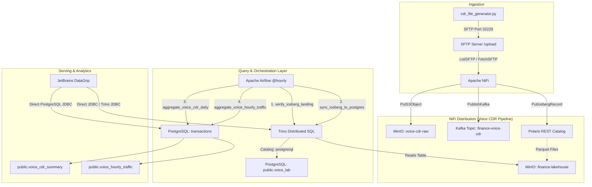

# Finance Data Platform — Complete Architecture, UI & DataGrip Guide

This comprehensive guide details the full end-to-end data platform architecture, all web UI dashboards, step-by-step DataGrip database configuration, and instructions for operating or rebuilding every pipeline stage independently via UI dashboards and SQL tools.

---

## 1. Quick Reference: Endpoints & Credentials

All external services are accessible via the Kubernetes master node `10.55.2.148` on dedicated NodePorts.

| Service | Protocol / URL | Internal Cluster Address | Username / Client ID | Password / Secret | Description |
| :--- | :--- | :--- | :--- | :--- | :--- |
| **Apache NiFi UI** | `https://10.55.2.148:30447/nifi` | `https://nifi.finance.svc.cluster.local:8443` | `finance` | `Fin@@2026Secure` | Real-time data routing & ETL canvas |
| **Airflow Web UI** | `http://10.55.2.148:31088` | `http://airflow-webserver.finance-airflow.svc.cluster.local:8080` | `finance` | `Fin#4321` | Pipeline orchestration & DAG scheduling |
| **MinIO Console** | `http://10.55.2.148:30901` | `http://minio.finance.svc.cluster.local:9001` | `finance` | `Fin@@2026Secure` | Object storage web UI (buckets & files) |
| **MinIO S3 API** | `http://10.55.2.148:30449` | `http://minio.finance.svc.cluster.local:9000` | `finance` | `Fin@@2026Secure` | S3-compatible object storage endpoint |
| **Trino SQL Engine** | `http://10.55.2.148:31085` | `http://trino.finance.svc.cluster.local:8080` | `admin` / `finance` | *(none required)* | Distributed SQL engine for Iceberg & Postgres |
| **Kafka UI (AKHQ)**| `http://10.55.2.148:30451` | `http://kafka-ui.finance.svc.cluster.local:8080` | *(open / public)* | *(none)* | View topics, messages, consumer lag |
| **Kafka Broker** | `10.55.2.148:30450` | `kafka.finance.svc.cluster.local:9092` | *(PLAINTEXT)* | *(none)* | Real-time event streaming cluster |
| **Schema Registry**| `http://10.55.2.148:30452` | `http://schema-registry.finance.svc.cluster.local:8081` | *(open)* | *(none)* | Confluent-compatible Avro schema registry |
| **Polaris Catalog**| `http://10.55.2.148:31181` | `http://polaris.finance.svc.cluster.local:8181` | `finance-client` | `FinanceSecret2026!` | Apache Polaris (REST Iceberg Catalog) |
| **SFTP Server** | `sftp://10.55.2.148:32229` | `sftp.finance.svc.cluster.local:22` | `cdr` | `3ffc10305cbabcb3c9b0bd6c89b63d4b` | CDR landing folder (`/upload`) |
| **PostgreSQL DB** | `10.55.2.148:5432` | `postgres.finance.svc.cluster.local:5432` | `finance` | `Fin@@2026Secure` | Primary RDBMS (`transactions` & `finance` DB) |
| **GitLab Repo** | `http://10.55.2.155/root/finance.git` | `http://10.55.2.155` | `finance` | `Fin#4321` | Code & DAG repository (main branch) |

---

## 2. End-to-End Pipeline Architecture



---

## 3. Connecting to Databases with JetBrains DataGrip

### A. PostgreSQL Connection (`transactions` Database)
Use this connection to query raw synced records and aggregated reporting tables.

1. Open **DataGrip** -> Click **+** (New) -> **Data Source** -> **PostgreSQL**.
2. Fill in the connection settings:
   - **Name**: `Finance PostgreSQL (Transactions)`
   - **Host**: `10.55.2.148`
   - **Port**: `5432`
   - **Authentication**: `User & Password`
   - **User**: `finance`
   - **Password**: `Fin@@2026Secure`
   - **Database**: `transactions`
   - **URL Preview**: `jdbc:postgresql://10.55.2.148:5432/transactions`
3. Click **Test Connection** (green checkmark will appear).
4. Go to the **Schemas** tab and check:
   - `public` (contains `voice_lab`, `voice_cdr_summary`, `voice_hourly_traffic`)
   - `polaris_schema` (contains internal Polaris catalog entities)
5. Click **OK** to save.

#### Key Queries to Run in DataGrip:
```sql
-- Check synced CDR records
SELECT * FROM public.voice_lab ORDER BY create_date DESC LIMIT 50;

-- Check daily aggregated KPI summaries
SELECT * FROM public.voice_cdr_summary ORDER BY record_date DESC;

-- Check hourly network traffic breakdown
SELECT * FROM public.voice_hourly_traffic ORDER BY record_hour DESC;
```

---

### B. Trino Connection (Federated Iceberg + PostgreSQL Catalog)
Trino allows querying the Apache Iceberg data lakehouse directly, as well as running federated cross-catalog queries between Iceberg and PostgreSQL.

1. Open **DataGrip** -> Click **+** (New) -> **Data Source** -> **Trino**.
   *(If Trino driver is not installed, click "Download Driver" in DataGrip)*
2. Fill in connection details:
   - **Name**: `Finance Trino (Lakehouse & Iceberg)`
   - **Host**: `10.55.2.148`
   - **Port**: `31085`
   - **Authentication**: `No Authentication` (or User-only)
   - **User**: `finance` (or `admin`)
   - **Password**: *(leave blank)*
   - **Catalog**: `finance`
   - **Schema**: `cdrs`
   - **URL Preview**: `jdbc:trino://10.55.2.148:31085/finance/cdrs`
3. Click **Test Connection**.
4. Click **OK** to save.

#### Key Queries to Run in DataGrip:
```sql
-- Query the Apache Iceberg Table directly
SELECT 
    cdr_id,
    cdr_type,
    status,
    create_date,
    callingpartynumber,
    calledpartynumber,
    actual_usage,
    el_record_date,
    load_date
FROM finance.cdrs.voice_lab
ORDER BY load_date DESC
LIMIT 100;

-- Inspect Iceberg Metadata Snapshots & History
SELECT * FROM finance.cdrs."voice_lab$snapshots";
SELECT * FROM finance.cdrs."voice_lab$history";
SELECT * FROM finance.cdrs."voice_lab$partitions";

-- Federated Cross-Catalog Query: Compare Iceberg count vs PostgreSQL count
SELECT 
    (SELECT COUNT(*) FROM finance.cdrs.voice_lab) AS iceberg_count,
    (SELECT COUNT(*) FROM postgresql.public.voice_lab) AS postgres_count;
```

---

## 4. Apache NiFi: Pipeline Canvas & Component Setup

### Accessing the Canvas
1. Open Chrome/Firefox to: `https://10.55.2.148:30447/nifi`
2. Accept the self-signed SSL certificate warning.
3. Login with:
   - **Username**: `finance`
   - **Password**: `Fin@@2026Secure`
4. On the root canvas, double click into the **Voice CDR Pipeline** process group (`ID: 0fca5b69-01a1-1000-bd46-70a7f9fcb4b1`).

---

### Processors in the Flow
The pipeline consists of 5 core processors running concurrently:

#### 1. `ListSFTP - Voice CDRs`
- **Type**: `org.apache.nifi.processors.standard.ListSFTP`
- **Hostname**: `sftp.finance.svc.cluster.local` (or `10.55.2.148`)
- **Port**: `22` (internal) or `32229` (external)
- **Username**: `cdr`
- **Password**: `3ffc10305cbabcb3c9b0bd6c89b63d4b`
- **Remote Path**: `upload`
- **File Filter Regex**: `.*\.p` (or `.*`)
- **Scheduling**: Timer driven, `10 sec`

#### 2. `FetchSFTP - Voice CDRs`
- **Type**: `org.apache.nifi.processors.standard.FetchSFTP`
- **Hostname**: `sftp.finance.svc.cluster.local`
- **Port**: `22`
- **Username**: `cdr`
- **Password**: `3ffc10305cbabcb3c9b0bd6c89b63d4b`
- **Remote File**: `${path}/${filename}`
- **Completion Strategy**: `None` (or `Delete File` if auto-cleanup is desired)

#### 3. `PutS3Object - Raw MinIO Archive`
- **Type**: `org.apache.nifi.processors.aws.s3.PutS3Object`
- **Object Key**: `voice_cdrs/${now():format('yyyy/MM/dd')}/${filename}`
- **Bucket**: `voice-cdr-raw`
- **Endpoint Override URL**: `http://minio.finance.svc.cluster.local:9000`
- **AWS Credentials Provider service**: `FinanceAWSCredentials`

#### 4. `PublishKafka - Voice Topic`
- **Type**: `org.apache.nifi.kafka.processors.PublishKafka`
- **Kafka Connection Service**: `FinanceKafkaConnectionService` (`kafka.finance.svc.cluster.local:9092`)
- **Topic Name**: `finance-voice-cdr`
- **Delivery Guarantee**: `1` (or `Best Effort`)

#### 5. `PutIcebergRecord - Land to Iceberg`
- **Type**: `org.apache.nifi.processors.iceberg.PutIcebergRecord`
- **Record Reader**: `VoicePSVReader`
- **Iceberg Catalog**: `FinanceRESTIcebergCatalog`
- **Iceberg Table Namespace**: `cdrs`
- **Iceberg Table Name**: `voice_lab`
- **Iceberg Writer**: `FinanceParquetIcebergWriter`
- **Number of Retries**: `3`

---

### Controller Services Configuration
To view or edit controller services in NiFi:
Right-click on an empty spot in the canvas -> **Configure** -> **Controller Services** tab.

1. **`FinanceRESTIcebergCatalog`**
   - **Type**: `org.apache.nifi.services.iceberg.catalog.RESTIcebergCatalog`
   - **Catalog URI**: `http://polaris.finance.svc.cluster.local:8181/api/catalog`
   - **Warehouse**: `finance_warehouse`
   - **Authentication Strategy**: `BEARER`
   - **Bearer Token**: *(Generated JWT token from Polaris OAuth endpoint)*
   - **Access Delegation Strategy**: `disabled`

2. **`FinanceParquetIcebergWriter`**
   - **Type**: `org.apache.nifi.services.iceberg.parquet.ParquetIcebergWriter`
   - **Compression Codec**: `SNAPPY` (or `ZSTD`)

3. **`FinanceS3FileIOProvider`**
   - **Type**: `org.apache.nifi.services.iceberg.aws.S3IcebergFileIOProvider`
   - **Endpoint**: `http://minio.finance.svc.cluster.local:9000`
   - **S3 Path Style Access**: `true`
   - **AWSCredentialsProvider**: `FinanceAWSCredentials`

4. **`VoicePSVReader`**
   - **Type**: `org.apache.nifi.csv.CSVReader`
   - **Schema Access Strategy**: `Use 'Schema Name' Property`
   - **Schema Registry**: `FinanceSchemaRegistry`
   - **Schema Name**: `finance-voice-cdr`
   - **Value Separator**: `|`
   - **Treat First Line as Header**: `false`

5. **`FinanceSchemaRegistry`**
   - **Type**: `org.apache.nifi.confluent.schemaregistry.ConfluentSchemaRegistry`
   - **Schema Registry URLs**: `http://schema-registry.finance.svc.cluster.local:8081`

6. **`FinanceKafkaConnectionService`**
   - **Type**: `org.apache.nifi.kafka.service.Kafka3ConnectionService`
   - **Bootstrap Servers**: `kafka.finance.svc.cluster.local:9092`

7. **`FinanceAWSCredentials`**
   - **Type**: `org.apache.nifi.processors.aws.credentials.provider.service.AWSCredentialsProviderControllerService`
   - **Access Key ID**: `finance`
   - **Secret Access Key**: `Fin@@2026Secure`

---

## 5. Apache Airflow: Orchestration & DAG Runs

### Accessing Airflow UI
1. Navigate to: `http://10.55.2.148:31088`
2. Sign in with:
   - **Username**: `finance`
   - **Password**: `Fin#4321`

### DAG Details: `voice_cdr_pipeline`
- **Schedule**: `@hourly`
- **Repository Location**: `/home/finance/finance_repo/dags/voice_cdr_pipeline.py`
- **Git Sync**: Automatic background sync from `http://10.55.2.155/root/finance.git`

### DAG Execution Flow:
1. **`verify_iceberg_landing`**: Queries Trino (`http://trino.finance.svc.cluster.local:8080/v1/statement`) to verify that `finance.cdrs.voice_lab` has new data.
2. **`sync_iceberg_to_postgres`**: Performs a high-performance cross-catalog INSERT query via Trino:
   ```sql
   INSERT INTO postgresql.public.voice_lab (...)
   SELECT ... FROM finance.cdrs.voice_lab i
   LEFT JOIN postgresql.public.voice_lab p ON i.cdr_id = p.cdr_id
   WHERE p.cdr_id IS NULL;
   ```
3. **`aggregate_voice_cdr_daily`** & **`aggregate_voice_hourly_traffic`** *(run in parallel)*:
   - Calculate KPIs (call count, call volume, duration, caller counts) directly in PostgreSQL `transactions`.
   - Uses `ON CONFLICT (...) DO UPDATE` for idempotent UPSERTs.

---

## 6. How to Generate & Ingest Synthetic CDR Data

A generator script is located on the host at `/home/finance/cdr_file_generator.py`.

### Generating Files Locally & Pushing to SFTP:
You can run this Python snippet on the master node (`10.55.2.148`) or any development machine to push batches of CDRs straight into SFTP:

```python
import paramiko
from datetime import datetime
import random, string

# SFTP Connection
ssh = paramiko.SSHClient()
ssh.set_missing_host_key_policy(paramiko.AutoAddPolicy())
ssh.connect("10.55.2.148", port=32229, username="cdr", password="3ffc10305cbabcb3c9b0bd6c89b63d4b")
sftp = ssh.open_sftp()

# Generate records
records = []
now = datetime.now()
timestamp_str = now.strftime("%Y%m%d%H%M")
filename = f"cdr_voice_{now.strftime('%Y%m%d%H%M%S')}_{random.randint(100, 999)}.p"

for i in range(25):
    cdr_id = str(random.randint(3000000, 3999999))
    duration = str(random.randint(10, 300))
    caller = "25261" + "".join(random.choices(string.digits, k=7))
    callee = "25261" + "".join(random.choices(string.digits, k=7))
    imsi = "63201" + "".join(random.choices(string.digits, k=10))
    cell_id = "".join(random.choices(string.digits, k=6))
    
    # 19 fields matching schema
    row = [
        cdr_id, "01", "0", timestamp_str, timestamp_str, timestamp_str,
        caller, duration, caller, callee, imsi, imsi,
        callee, cell_id, duration, "0", str(random.randint(900000, 999999)),
        "".join(random.choices(string.digits, k=15)), caller
    ]
    records.append("|".join(row))

content = "\n".join(records) + "\n"

# Atomic SFTP Upload
with sftp.file(f"/upload/.{filename}", "w") as f:
    f.write(content)
sftp.rename(f"/upload/.{filename}", f"/upload/{filename}")

print(f"Uploaded {filename} with {len(records)} records to SFTP /upload")
sftp.close()
ssh.close()
```

Once uploaded:
1. NiFi's `ListSFTP` detects the file immediately.
2. `FetchSFTP` downloads it.
3. `PutS3Object` stores raw backup in MinIO bucket `voice-cdr-raw`.
4. `PublishKafka` streams it to topic `finance-voice-cdr`.
5. `PutIcebergRecord` commits it as Parquet data into `finance.cdrs.voice_lab`.
6. Airflow scheduled DAG synchronizes it to PostgreSQL and populates summary dashboards!

---

## 7. Troubleshooting & Maintenance Commands

### Refreshing Polaris Bearer Token (if expired)
If NiFi's Iceberg catalog token expires after 1 hour, generate a fresh token:
```bash
curl -s -X POST http://10.55.2.148:31181/api/catalog/v1/oauth/tokens \
  -d 'grant_type=client_credentials&client_id=finance-client&client_secret=FinanceSecret2026!&scope=PRINCIPAL_ROLE:ALL' \
  -H 'Content-Type: application/x-www-form-urlencoded'
```
Copy the `access_token` and paste it into the **Bearer Token** field in the `FinanceRESTIcebergCatalog` controller service in NiFi.

### Checking Kubernetes Services Status
```bash
kubectl get pods -n finance
kubectl get svc -n finance
kubectl logs -n finance deployment/polaris --tail=50
kubectl logs -n finance nifi-0 --tail=50
```

### Manual Trigger of Airflow DAG
```bash
kubectl exec -n finance-airflow deployment/airflow-webserver -- airflow dags trigger voice_cdr_pipeline
```
