# 🏦 Enterprise Bank Data Platform: Lab 4 Modular Pipeline & Apache Airflow Orchestration
## High-Availability Transaction Processing, Lakehouse Storage, Server Watchdog & Automated Incident Alerting
### Real-World Production Architecture: Dahabshiil Commercial & International Remittance Bank

---

## 📋 Executive Summary & Talking Points

This document provides a comprehensive, production-grade architectural guide explaining the **Lab 4 Data Pipeline** integrated with **Apache Airflow Orchestration** for an enterprise financial institution (**Dahabshiil Bank**). 

If you are presenting or explaining this platform to a client, technical director, or engineering interviewer, use this 30-second **Elevator Pitch**:

> *"Our architecture ingests millions of mission-critical banking transactions—including Core Banking CDC, SWIFT international remittances, ATM/POS switches, and server telemetry—using a modular 5-group Apache NiFi pipeline. By decoupling data into **Extract, Transform, Load, Monitoring, and Alerting**, we achieve zero-data-loss streaming into an Apache Iceberg Lakehouse backed by MinIO S3 and Polaris REST Catalog.*
>
> *Meanwhile, **Apache Airflow** acts as the platform's central brain: scheduling end-of-day financial reconciliation audits, syncing aggregated metrics into PostgreSQL analytics marts, compacting Iceberg partitions to prevent small-file degradation, and enforcing strict regulatory SLAs.*
>
> *Finally, our **Bank Watchdog** continuously monitors server infrastructure, transaction stream activity, and data consistency—instantly triggering automated alerts if a payment switch stalls, a server exceeds resource limits, or a single cent is unaccounted for during nightly reconciliation."*

---

## 📑 Table of Contents

1. [High-Level Architecture & End-to-End Topology](#1-high-level-architecture--end-to-end-topology)
2. [Real-World Banking Context: Dahabshiil Financial Services](#2-real-world-banking-context-dahabshiil-financial-services)
3. [Lab 4 Modular Ingestion Pipeline: Deep-Dive](#3-lab-4-modular-ingestion-pipeline-deep-dive)
   - 3.1 Group 1: `EXTRACT` (Multi-Node Load Balancing & Port Isolation)
   - 3.2 Group 2: `TRANSFORM` (RecordPath Mutation & In-Flight Serialization)
   - 3.3 Group 3: `LOAD` (Partition-Aligned Bin-Packing & Iceberg Ingestion)
   - 3.4 Group 4: `MONITORING` (Non-Intrusive Stream Tapping & Inactivity Heartbeats)
   - 3.5 Group 5: `ALERTING` (Unified Incident Tagging & Dispatch)
4. [Apache Airflow: The Lakehouse Orchestrator](#4-apache-airflow-the-lakehouse-orchestrator)
   - 4.1 Airflow Core Architecture & GitOps CI/CD Deployment
   - 4.2 Production DAG 1: Daily Financial Transaction Aggregation & Rollup
   - 4.3 Production DAG 2: Lakehouse-to-PostgreSQL Analytics Sync (Idempotent Partition Swap)
   - 4.4 Production DAG 3: Automated Iceberg Lakehouse Maintenance & Compaction
   - 4.5 Production DAG 4: End-of-Day Cross-System Reconciliation & SLA Monitor
5. [The "Bank Watch" System: Server & Service Monitoring Architecture](#5-the-bank-watch-system-server--service-monitoring-architecture)
   - 5.1 Three-Tier Watchdog Telemetry Model
   - 5.2 Stream Inactivity Watchdog (Detecting Silent Banking Switch Failures)
   - 5.3 Big Data Services Health Watchdog (NiFi, Kafka, Trino, MinIO, Polaris, Postgres)
   - 5.4 Automated Escalation & Incident Notification Matrix
6. [Visual Sequence Diagram: Incident Lifecycle & Reconciliation Flow](#6-visual-sequence-diagram-incident-lifecycle--reconciliation-flow)
7. [Step-by-Step Guide: How to Explain This Architecture to Someone](#7-step-by-step-guide-how-to-explain-this-architecture-to-someone)
8. [Cross-Platform Operations & Emergency Troubleshooting Matrix](#8-cross-platform-operations--emergency-troubleshooting-matrix)

---

## 1. High-Level Architecture & End-to-End Topology

The banking platform processes streaming transactions and batch settlement logs from multiple banking servers. The data flows through streaming ingestion, format conversion, partition alignment, lakehouse storage, distributed SQL analytics, orchestration, and continuous observability.

```mermaid
flowchart TD
    %% Workflow Class Definitions
    classDef startEnd fill:#E8EAF6,stroke:#3F51B5,stroke-width:2px,color:#1A237E;
    classDef step fill:#E3F2FD,stroke:#1565C0,stroke-width:2px,color:#0D47A1;
    classDef decision fill:#FFF9C4,stroke:#FBC02D,stroke-width:2px,color:#F57F17;
    classDef storage fill:#E8F5E9,stroke:#2E7D32,stroke-width:2px,color:#1B5E20;
    classDef airflow fill:#F3E5F5,stroke:#7B1FA2,stroke-width:2px,color:#4A148C;
    classDef alert fill:#FFEBEE,stroke:#C62828,stroke-width:2px,color:#B71C1C;

    WF_START([🏁 Step 1: Banking Transaction Origination]):::startEnd

    subgraph WF_SOURCES["🏦 Step 1.1: Core Banking & Peripheral Fleet"]
        direction TB
        S1["Core Banking Server (10.0.0.8): PostgreSQL CDC"]:::step
        S2["Payment Switch & ATM/POS (169.58.218.161): SFTP File Drops"]:::step
        S3["International Remittance Gateway: Encrypted REST API"]:::step
    end
    WF_START --> WF_SOURCES

    subgraph WF_INGEST["⚡ Step 2: Lab 4 Modular Ingestion Workflow (Apache NiFi)"]
        direction TB
        N1["Step 2.1: List & Fetch SFTP Settlement Files<br/>(Primary Node Listing + Round-Robin Queue)"]:::step
        N2["Step 2.2: Convert Text to Avro & Validate Schema<br/>(Confluent Schema Registry :8081)"]:::step
        N3["Step 2.3: RecordPath Event-Time Extraction<br/>(/create_date ➔ /el_record_date)"]:::step
        N4["Step 2.4: Partitioned Bin-Packing (50k-250k rows)<br/>(Correlated on el_record_date)"]:::step
        
        N1 --> N2 --> N3 --> N4
    end
    WF_SOURCES ==>|Live Banking Data| N1

    subgraph WF_TAP["⏱️ Parallel Stream-Tap Speedometer Workflow"]
        direction TB
        T1["Clone FlowFile Pointer at FetchSFTP"]:::step
        T2{"Traffic arrived in<br/>last 3 minutes?"}:::decision
        T3["Auto-terminate clone (0 disk cost)"]:::step
        T4["🚨 Emit Inactive Signal:<br/>Payment Switch Stalled!"]:::alert
        
        T1 --> T2
        T2 -->|YES: Normal| T3
        T2 -->|NO: > 180s Silence| T4
    end
    N1 -.->|Mirror Copy| T1

    subgraph WF_STORAGE["💾 Step 3: Lakehouse Commit Workflow"]
        direction TB
        ST1[("MinIO S3 Storage (:30900)<br/>s3://dahabshiil-lakehouse/ (Parquet)")]:::storage
        ST2[("Polaris REST Catalog (:8181)<br/>Optimistic Concurrency Snapshots")]:::storage
        ST1 <--> ST2
    end
    N4 ==>|PutIcebergRecord Multipart Write| WF_STORAGE

    subgraph WF_ORCHESTRATE["🌙 Step 4: Scheduled Lakehouse Orchestration (Apache Airflow)"]
        direction TB
        A1["00:30 AM: DAG 1 — Daily Branch Rollup (TrinoOperator)"]:::airflow
        A2["01:00 AM: DAG 2 — Idempotent Postgres Mart Sync"]:::airflow
        A3["02:00 AM: DAG 4 — Cross-System Reconciliation Audit"]:::airflow
        
        A1 --> A2 --> A3
    end
    WF_STORAGE <==>|Trino Distributed SQL (:8080)| WF_ORCHESTRATE

    subgraph WF_ALERTS["🚨 Step 5: Incident Escalation & Response Workflow"]
        direction TB
        DEC_AUDIT{"Did Core Bank & Lakehouse<br/>Balances Match 100%?"}:::decision
        A3 --> DEC_AUDIT
        
        AL_AUDIT_PASS["✅ Audit Verified: Email Daily Sign-Off to CFO"]:::storage
        AL_AUDIT_FAIL["🚨 Reconciliation Breach: Page Chief Risk Officer"]:::alert
        
        DEC_AUDIT -->|Variance = $0.00| AL_AUDIT_PASS
        DEC_AUDIT -->|Variance > $0.00| AL_AUDIT_FAIL
    end

    T4 ==>|Instant P1 Alarm| ONCALL_PAGER([📱 On-Call DataOps & SecOps]):::alert
    AL_AUDIT_FAIL ==>|Instant P1 Alarm| ONCALL_PAGER
```

---

## 2. Real-World Banking Context: Dahabshiil Financial Services

To explain this platform effectively, it is critical to connect the technical components to real-world banking operations. Dahabshiil processes millions of dollars daily across commercial banking, mobile money (e-Dahab), and international diaspora remittances (London, Dubai, Minneapolis to Hargeisa, Mogadishu, and Nairobi).

### 2.1 The Four Critical Banking Data Streams

| Data Stream | Source System | Format & Protocol | Business Significance | SLA / Risk Factor |
| :--- | :--- | :--- | :--- | :--- |
| **Core Banking Ledger (CDC)** | PostgreSQL / Oracle Enterprise Cluster | Debezium JSON / JDBC Streaming via Kafka | Every debit, credit, account balance, and Murabaha financing event. | **Zero Data Loss**. Even a single lost debit breaks regulatory audits. |
| **ATM / POS & Switch Settlements** | Base24 / BPC SmartVista Payment Switch | Pipe-delimited settlement files (`.p`) dropped via SFTP | Cash disbursements, card swipes, point-of-sale settlements across all branches. | **3-Minute Stalling Alert**. If switch files stop landing, ATMs are down. |
| **Cross-Border Remittances** | Web Portals & Agency Terminals (UK, UAE, US) | Encrypted JSON over mTLS REST endpoints | Money transfers sent to families; must undergo real-time AML/Sanctions screening. | **Real-Time Screening**. Block flagged persons before money is paid out. |
| **Server & Service Health Telemetry** | Kubernetes Pods & Bare-Metal Nodes | Prometheus metrics, JVM telemetry, Syslog | CPU, memory, disk I/O, queue depths, and network saturation of bank infrastructure. | **Proactive Prevention**. Alert before high memory causes cluster node crash. |

### 2.2 Sample Banking Remittance Transaction Payload
Below is the standard banking transaction payload flowing through the pipeline:

```json
{
  "remittance_reference": "DHB-TXN-20260930-883912",
  "originating_partner": "DAHABSHIIL_UK_LONDON",
  "originating_country": "GBR",
  "destination_country": "SOM",
  "source_currency": "GBP",
  "source_amount": 1500.00,
  "exchange_rate": 1.3250,
  "payout_currency": "USD",
  "payout_amount": 1987.50,
  "fee_usd": 15.00,
  "create_date": "202609301415",
  "sender": {
    "full_name": "Mustafe Jaamac Jaamac",
    "id_type": "UK_PASSPORT",
    "id_number": "UK99881230",
    "source_of_funds": "SALARY"
  },
  "beneficiary": {
    "full_name": "Faadumo Axmed Cilmi",
    "phone_number": "252634401122",
    "payout_method": "BRANCH_CASH_PICKUP",
    "payout_branch": "BURAO_CENTRAL_BRANCH"
  },
  "aml_status": "CLEAR"
}
```

---

## 3. Lab 4 Modular Ingestion Pipeline: Deep-Dive

In Day 3 development, ingestion flows are often drawn as single linear paths. In production banking, that approach causes system-wide cascading failures. 

**Lab 4 introduces strict Process Group Encapsulation:**
1. The canvas is partitioned into **5 specialized functional domains**: `EXTRACT`, `TRANSFORM`, `LOAD`, `MONITORING`, and `ALERTING`.
2. **The Encapsulation Law**: Child groups communicate **exclusively through Input and Output Ports**. No direct processor-to-processor wire crosses a boundary.
3. **Inheritance**: Top-level Parameter Contexts (SFTP credentials, Schema Registry URLs, S3 access keys) are declared once on the parent `BANK_TRANSACTION_PIPELINE` and inherited by all children.

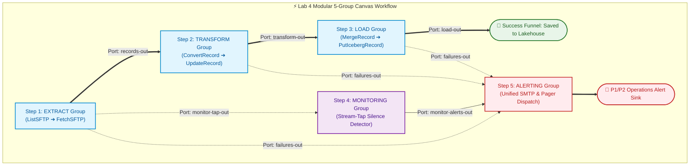

---

### 3.1 Group 1: `EXTRACT` (Multi-Node Load Balancing & Port Isolation)

The `EXTRACT` group connects to banking file servers (SFTP drops from ATMs, payment switches, and SWIFT gateways).

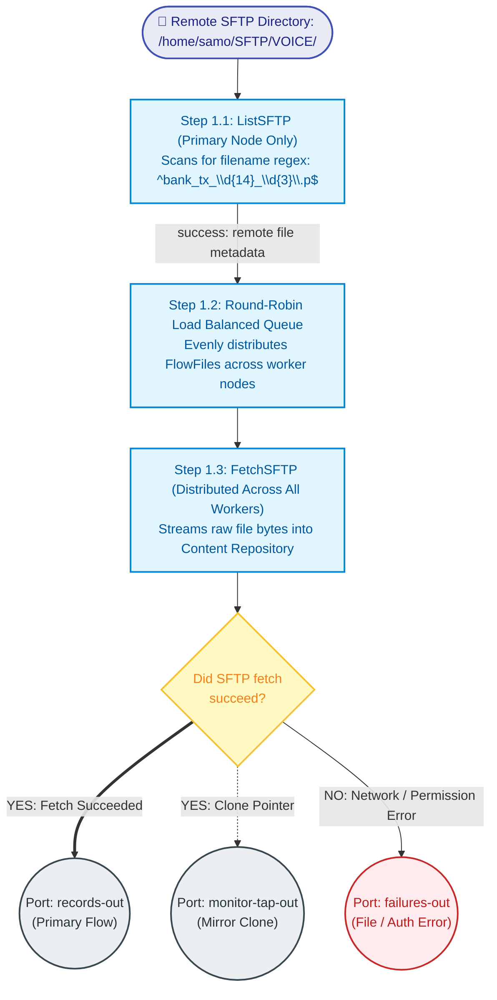

#### Key Technical Principles:
1. **Primary Node Execution for `ListSFTP`**:
   - In a 3-node NiFi cluster, running `ListSFTP` on all nodes causes triple-downloads of the same banking settlement files, corrupting transaction balances. Scheduling on **Primary Node Only** ensures files are inventoried once.
2. **Round-Robin Load Balancing on Ingestion Queue**:
   - `ListSFTP` produces metadata FlowFiles containing remote file paths.
   - If left with default routing, the Primary Node fetches all gigabytes of files, saturating its CPU and leaving worker nodes 1 and 2 idle.
   - Configuring the queue with **Load Balance Strategy: `Round Robin`** evenly distributes fetch tasks across all Kubernetes worker pods, balancing network throughput.
3. **Dual-Connection Stream Tapping**:
   - The `success` relationship of `FetchSFTP` connects to two output ports:
     - `records-out`: Dispatched to `TRANSFORM` for the primary data path.
     - `monitor-tap-out`: Dispatched to `MONITORING`. NiFi's copy-on-write architecture clones the metadata pointer with zero memory or disk payload duplication.

---

### 3.2 Group 2: `TRANSFORM` (RecordPath Mutation & In-Flight Serialization)

Raw banking files arrive as pipe-delimited text (`.p`). Parsing strings in downstream components consumes excessive CPU.

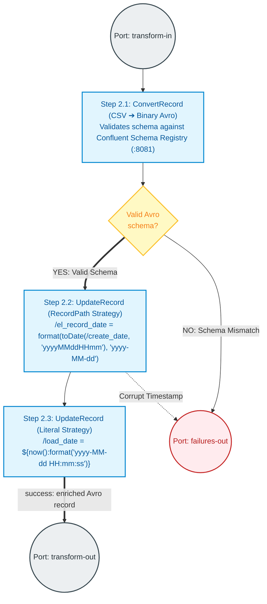

#### Key Technical Principles:
1. **In-Flight Format Conversion (CSV ➔ Avro)**:
   - `ConvertRecord` transforms delimited text into binary Apache Avro governed by the Confluent Schema Registry (`bank-tx-partitioned`). Downstream processors manipulate strongly-typed object trees rather than re-tokenizing raw strings.
2. **Event-Time vs. Arrival-Time Partitioning**:
   - *The Anti-Pattern*: Deriving the date from the filename (`bank_tx_20260930...`). If a switch file is delayed by 2 hours over midnight, transactions made on September 29 land in the September 30 partition, distorting daily financial audits!
   - *The Production Solution*: Field `/create_date` contains the exact transaction timestamp from the ATM or SWIFT gateway.
3. **RecordPath Evaluation**:
   - In `UpdateRecord`, setting `Replacement Value Strategy` to **`Record Path Value`** allows executing RecordPath functions directly inside the Avro payload:
     ```text
     /el_record_date = format(toDate(/create_date, 'yyyyMMddHHmm'), 'yyyy-MM-dd')
     ```
   - > [!IMPORTANT]
     > Setting `Replacement Value Strategy` to `Literal Value` causes NiFi to write the formula string verbatim into the data, causing Iceberg write failures!

---

### 3.3 Group 3: `LOAD` (Partition-Aligned Bin-Packing & Iceberg Ingestion)

Writing thousands of tiny streaming files into MinIO S3 creates the dreaded **Small-Files Problem**, overwhelming the Polaris metadata catalog and causing Trino queries to time out.

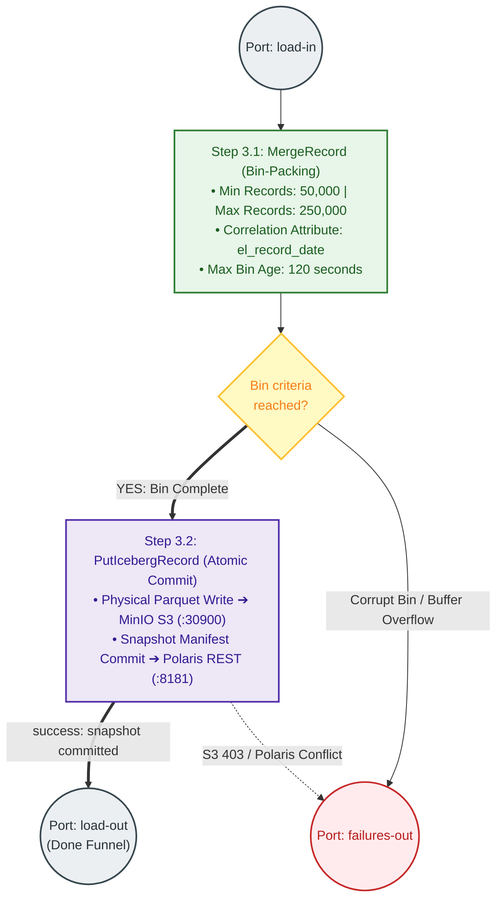

#### Key Technical Principles:
1. **Partition-Aligned Bin-Packing (`MergeRecord`)**:
   - Merges small incoming batches into optimal chunks of **50,000 to 250,000 records** before committing to storage.
   - Setting `Correlation Attribute Name = el_record_date` guarantees that transactions from different days are **never mixed in the same bin**, perfectly aligning with Iceberg's `day(el_record_date)` partition spec.
2. **Atomic Iceberg Metadata Commits (`PutIcebergRecord`)**:
   - Physical data files are written to MinIO S3 (`s3://dahabshiil-lakehouse/warehouse/banking/transactions_raw/data/`).
   - `PutIcebergRecord` commits new snapshot manifests to **Apache Polaris REST Catalog** using optimistic concurrency control.
   - All Trino queries immediately see complete, consistent snapshots with zero dirty reads.

---

### 3.4 Group 4: `MONITORING` (Non-Intrusive Stream Tapping & Inactivity Heartbeats)

Traditional pipelines place monitoring processors *inline* in the main processing flow. If a monitoring processor crashes, blocks, or suffers backpressure, the entire bank transaction ingestion stops.

**Lab 4 introduces Non-Intrusive Stream Tapping**:

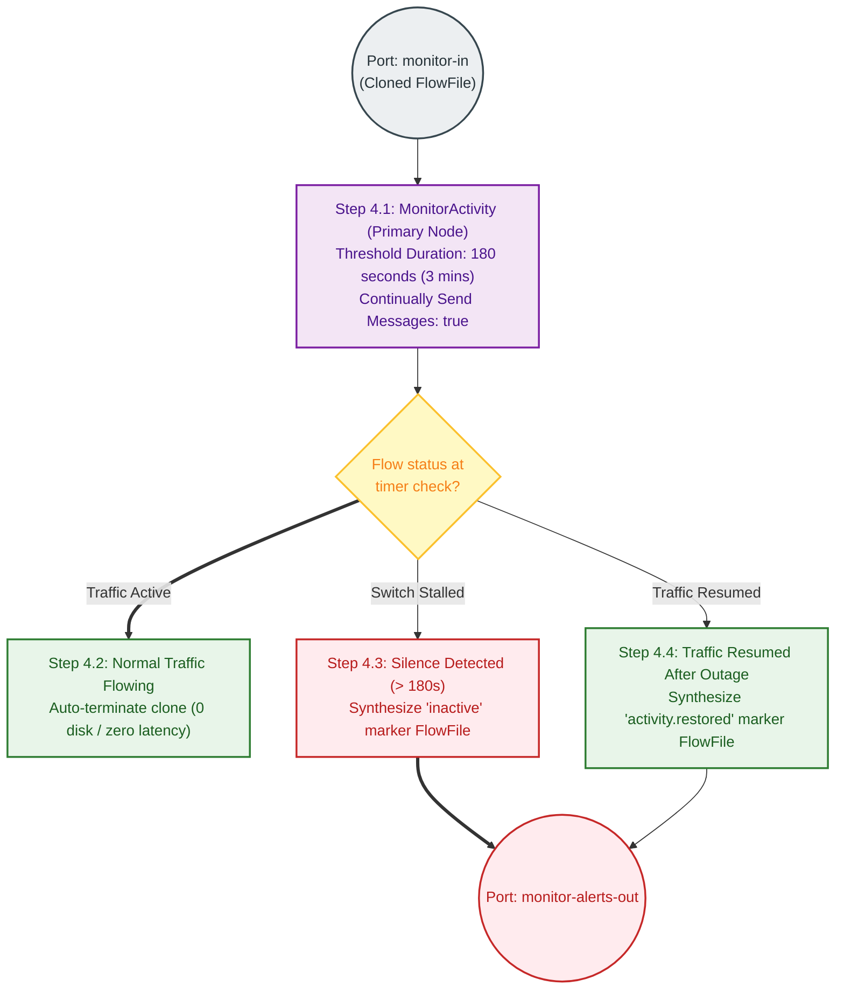

#### How Stream Tapping Operates:
1. Normal transaction FlowFiles enter `MonitorActivity`.
2. The `success` relationship is **auto-terminated**, dropping the cloned FlowFile immediately. The main ingestion pipeline continues without delay.
3. If no transaction arrives within **3 minutes** (e.g., ATM network drop, payment switch crash), `MonitorActivity` automatically generates a synthesized **`inactive` marker FlowFile** containing the duration of silence.
4. When banking transactions resume, `MonitorActivity` generates an **`activity.restored` marker FlowFile**.
5. Both markers route directly to `ALERTING` to notify on-call engineers.

---

### 3.5 Group 5: `ALERTING` (Unified Incident Tagging & Dispatch)

Enterprise operations require a single, unified alerting interface handling heterogeneous signals:

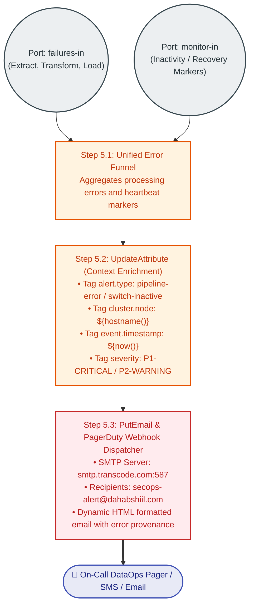

---

## 4. Apache Airflow: The Lakehouse Orchestrator

While NiFi handles continuous streaming ingestion, **Apache Airflow is the master conductor** of the bank's scheduled batch processes, cross-system reconciliations, and regulatory compliance.

```text
┌───────────────────────────────────────────────────────────────────────────────────┐
│                      WHAT AIRFLOW DOES IN THE BANK PLATFORM                       │
│                                                                                   │
│  1. Nightly Financial Aggregation: Summarizes millions of raw transactions into  │
│     hourly and daily branch ledger rollups.                                       │
│  2. Lakehouse-to-Postgres Analytics Sync: Pushes reconciled metrics into executive│
│     reporting databases using idempotent partition swaps.                         │
│  3. Iceberg Table Maintenance: Runs compaction (OPTIMIZE), expires snapshots,   │
│     and cleans orphan files to keep storage fast and lean.                        │
│  4. Cross-System Financial Reconciliation: Audits Core Banking DB balances        │
│     against Iceberg Lakehouse balances, alerting if variance exceeds $0.00.       │
└───────────────────────────────────────────────────────────────────────────────────┘
```

### 4.1 Airflow Core Architecture & GitOps CI/CD Deployment

In our Kubernetes environment (`samo` namespace), Airflow DAGs are **never edited manually on production nodes**. Manual edits risk syntax errors that crash the scheduler and lack compliance audit trails.

Instead, we enforce a **GitOps Deployment Workflow** via enterprise GitLab (`gitlab.transcode.com`):

```mermaid
flowchart TD
    %% Workflow Definitions
    classDef step fill:#E1F5FE,stroke:#0288D1,stroke-width:2px,color:#01579B;
    classDef dec fill:#FFF9C4,stroke:#FBC02D,stroke-width:2px,color:#F57F17;
    classDef git fill:#EDE7F6,stroke:#512DA8,stroke-width:2px,color:#311B92;
    classDef k8s fill:#E8F5E9,stroke:#2E7D32,stroke-width:2px,color:#1B5E20;

    DEV([👨‍💻 Step 1: Data Engineer (Local Feature Branch)]):::git
    
    W1["Step 2: GitLab CE (:30088)<br/>Merge Request + Code Review"]:::git
    DEV -->|git push| W1

    W2["Step 3: Automated GitLab CI/CD Pipeline<br/>• Static flake8 / black linting<br/>• Headless pytest DAG integrity validation"]:::git
    W1 --> W2

    DEC_CI{"Did GitLab CI/CD<br/>pipeline pass?"}:::dec
    W2 --> DEC_CI

    W3["Step 4: Merge to Protected 'main' Branch<br/>(Immutable git commit hash signed)"]:::git
    DEC_CI ==>|YES: All Tests Pass| W3
    DEC_CI -->|NO: Syntax / Import Error| DEV

    subgraph K8S_CLUSTER["⚡ Kubernetes Airflow Namespace (samo)"]
        direction TB
        W4["Step 5: git-sync Sidecar Container<br/>Polls GitLab repository every 60s via HTTPS deploy token"]:::k8s
        W5[("Shared Volume: /opt/airflow/dags<br/>Atomic zero-downtime symlink swap")]:::k8s
        W6["Step 6: Scheduler & Webserver Pods<br/>Auto-refresh DAG registry without pod restarts"]:::k8s
        
        W4 -->|git pull| W5
        W5 -->|inotify detection| W6
    end

    W3 ==>|Deploy Token Pull| W4
```

---

### 4.2 Production DAG 1: Daily Financial Transaction Aggregation & Rollup
* **File**: `dags/dag1_daily_bank_transaction_rollup.py`
* **Schedule**: `@daily` (Evaluated at 00:30 Africa/Mogadishu time)
* **Target Table**: `lakehouse.banking.daily_branch_summary`

```python
import pendulum
from airflow import DAG
from airflow.providers.trino.operators.trino import TrinoOperator
from airflow.operators.email import EmailOperator

LOCAL_TZ = pendulum.timezone("Africa/Mogadishu")

default_args = {
    'owner': 'dahabshiil-dataops',
    'depends_on_past': False,
    'start_date': pendulum.datetime(2026, 9, 1, tz=LOCAL_TZ),
    'retries': 2,
    'retry_delay': pendulum.duration(minutes=5),
}

with DAG(
    dag_id='dag1_daily_bank_transaction_rollup',
    default_args=default_args,
    schedule='30 0 * * *',  # Every night at 00:30 EAT
    catchup=False,
    tags=['banking', 'lakehouse', 'aggregation'],
) as dag:

    # Aggregates raw transactions into hourly/branch rollup metrics
    aggregate_branch_totals = TrinoOperator(
        task_id='aggregate_branch_totals',
        trino_conn_id='trino_lakehouse',
        sql="""
        MERGE INTO lakehouse.banking.daily_branch_summary target
        USING (
            SELECT 
                CAST(el_record_date AS DATE) AS summary_date,
                payout_branch,
                payout_currency,
                COUNT(*) AS total_tx_count,
                SUM(payout_amount) AS total_disbursed_amount,
                SUM(fee_usd) AS total_fee_revenue,
                CURRENT_TIMESTAMP AS calculated_at
            FROM lakehouse.banking.transactions_raw
            WHERE el_record_date = DATE '{{ macros.ds_add(ds, -1) }}'
            GROUP BY 1, 2, 3
        ) source
        ON target.summary_date = source.summary_date 
           AND target.payout_branch = source.payout_branch
           AND target.payout_currency = source.payout_currency
        WHEN MATCHED THEN 
            UPDATE SET 
                total_tx_count = source.total_tx_count,
                total_disbursed_amount = source.total_disbursed_amount,
                total_fee_revenue = source.total_fee_revenue,
                calculated_at = source.calculated_at
        WHEN NOT MATCHED THEN 
            INSERT (summary_date, payout_branch, payout_currency, total_tx_count, total_disbursed_amount, total_fee_revenue, calculated_at)
            VALUES (source.summary_date, source.payout_branch, source.payout_currency, source.total_tx_count, source.total_disbursed_amount, source.total_fee_revenue, source.calculated_at);
        """,
    )

    notify_finance = EmailOperator(
        task_id='notify_finance_aggregation_complete',
        to='finance-ops@dahabshiil.com',
        subject='Dahabshiil Bank: Daily Rollup Complete - {{ macros.ds_add(ds, -1) }}',
        html_content="""
        <h3>Daily Branch Rollup Completed Successfully</h3>
        <p>Transaction aggregations for date <b>{{ macros.ds_add(ds, -1) }}</b> have merged into <code>lakehouse.banking.daily_branch_summary</code>.</p>
        """,
    )

    aggregate_branch_totals >> notify_finance
```

---

### 4.3 Production DAG 2: Lakehouse-to-PostgreSQL Analytics Sync (Idempotent Partition Swap)
* **File**: `dags/dag2_sync_lakehouse_to_postgres.py`
* **Pattern**: Delete-Then-Insert (Guarantees exact idempotency on backfills)
* **Target Table**: `rdbms.public.daily_bank_mart` (Postgres analytics mart powering executive Grafana/Tableau dashboards)

```python
import pendulum
from airflow import DAG
from airflow.providers.postgres.operators.postgres import PostgresOperator
from airflow.providers.trino.hooks.trino import TrinoHook
from airflow.operators.python import PythonOperator

LOCAL_TZ = pendulum.timezone("Africa/Mogadishu")

default_args = {
    'owner': 'dahabshiil-dataops',
    'start_date': pendulum.datetime(2026, 9, 1, tz=LOCAL_TZ),
    'retries': 2,
}

with DAG(
    dag_id='dag2_sync_lakehouse_to_postgres',
    default_args=default_args,
    schedule='0 1 * * *',  # Nightly at 01:00 EAT (after DAG 1 completes)
    catchup=False,
    tags=['banking', 'rdbms', 'postgres-sync'],
) as dag:

    # Step 1: Idempotently clear the target partition in Postgres
    delete_existing_partition = PostgresOperator(
        task_id='delete_existing_partition',
        postgres_conn_id='rdbms_postgres',
        sql="""
        DELETE FROM public.daily_bank_mart 
        WHERE summary_date = '{{ macros.ds_add(ds, -1) }}';
        """,
    )

    # Step 2: Stream summarized data from Trino Iceberg into Postgres
    def transfer_trino_to_postgres(**context):
        from airflow.providers.postgres.hooks.postgres import PostgresHook
        target_date = context['macros'].ds_add(context['ds'], -1)
        
        trino = TrinoHook(trino_conn_id='trino_lakehouse')
        postgres = PostgresHook(postgres_conn_id='rdbms_postgres')
        
        records = trino.get_records(f"""
            SELECT summary_date, payout_branch, payout_currency, total_tx_count, total_disbursed_amount, total_fee_revenue
            FROM lakehouse.banking.daily_branch_summary
            WHERE summary_date = DATE '{target_date}'
        """)
        
        if records:
            postgres.insert_rows(
                table='public.daily_bank_mart',
                rows=records,
                target_fields=['summary_date', 'payout_branch', 'payout_currency', 'total_tx_count', 'total_disbursed_amount', 'total_fee_revenue'],
                commit_every=1000
            )

    sync_data = PythonOperator(
        task_id='sync_data_to_postgres',
        python_callable=transfer_trino_to_postgres,
    )

    delete_existing_partition >> sync_data
```

---

### 4.4 Production DAG 3: Automated Iceberg Lakehouse Maintenance & Compaction
* **File**: `dags/dag3_iceberg_maintenance_compaction.py`
* **Purpose**: Solves Small Files, removes deleted snapshot metadata, purges orphan files.

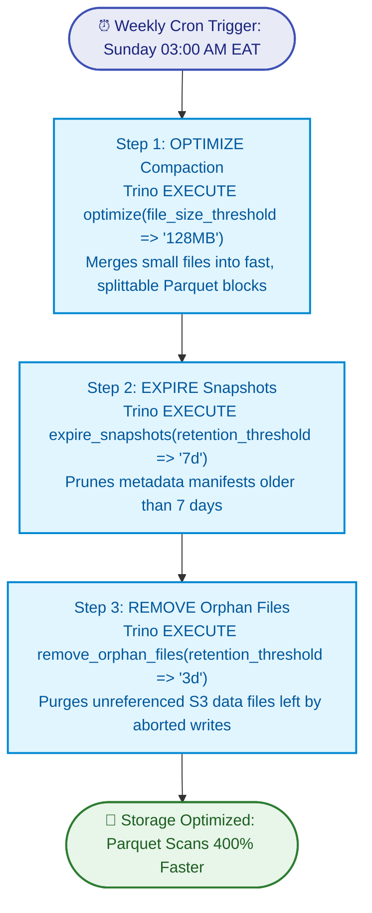

```python
import pendulum
from airflow import DAG
from airflow.providers.trino.operators.trino import TrinoOperator

LOCAL_TZ = pendulum.timezone("Africa/Mogadishu")

with DAG(
    dag_id='dag3_iceberg_maintenance_compaction',
    schedule='0 3 * * 0',  # Weekly on Sunday at 03:00 AM EAT
    start_date=pendulum.datetime(2026, 9, 1, tz=LOCAL_TZ),
    catchup=False,
    tags=['lakehouse', 'iceberg', 'maintenance'],
) as dag:

    # 1. Compact small Parquet files into optimal 128MB splits
    optimize_table = TrinoOperator(
        task_id='optimize_table_compaction',
        trino_conn_id='trino_lakehouse',
        sql="""
        ALTER TABLE lakehouse.banking.transactions_raw 
        EXECUTE optimize(file_size_threshold => '128MB');
        """,
    )

    # 2. Expire old table snapshots older than 7 days
    expire_snapshots = TrinoOperator(
        task_id='expire_table_snapshots',
        trino_conn_id='trino_lakehouse',
        sql="""
        ALTER TABLE lakehouse.banking.transactions_raw 
        EXECUTE expire_snapshots(retention_threshold => '7d');
        """,
    )

    # 3. Clean orphan S3 objects abandoned by failed transactions
    remove_orphans = TrinoOperator(
        task_id='remove_orphan_files',
        trino_conn_id='trino_lakehouse',
        sql="""
        ALTER TABLE lakehouse.banking.transactions_raw 
        EXECUTE remove_orphan_files(retention_threshold => '3d');
        """,
    )

    optimize_table >> expire_snapshots >> remove_orphans
```

---

### 4.5 Production DAG 4: End-of-Day Cross-System Reconciliation & SLA Monitor
* **File**: `dags/dag4_financial_reconciliation_audit.py`
* **Purpose**: Compares transaction counts and dollar totals between the **Core Banking PostgreSQL Database** and the **Iceberg Lakehouse**. If there is any discrepancy, an emergency alert is triggered.

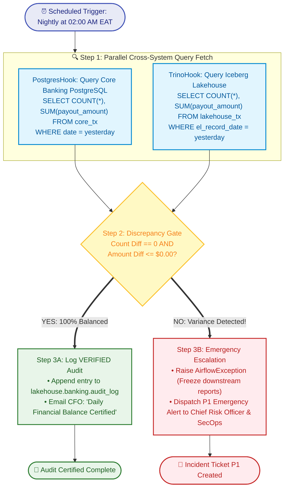

```python
import pendulum
from airflow import DAG
from airflow.operators.python import PythonOperator
from airflow.providers.trino.hooks.trino import TrinoHook
from airflow.providers.postgres.hooks.postgres import PostgresHook
from airflow.exceptions import AirflowException

LOCAL_TZ = pendulum.timezone("Africa/Mogadishu")

def perform_eod_reconciliation(**context):
    audit_date = context['macros'].ds_add(context['ds'], -1)
    
    # 1. Fetch official numbers from Core Banking PostgreSQL
    pg_hook = PostgresHook(postgres_conn_id='rdbms_postgres')
    pg_res = pg_hook.get_first(f"""
        SELECT COUNT(*), COALESCE(SUM(payout_amount), 0)
        FROM core_banking_transactions
        WHERE CAST(created_at AS DATE) = '{audit_date}';
    """)
    core_count, core_amount = pg_res[0], float(pg_res[1])

    # 2. Fetch ingested numbers from Iceberg Lakehouse via Trino
    trino_hook = TrinoHook(trino_conn_id='trino_lakehouse')
    trino_res = trino_hook.get_first(f"""
        SELECT COUNT(*), COALESCE(SUM(payout_amount), 0)
        FROM lakehouse.banking.transactions_raw
        WHERE el_record_date = DATE '{audit_date}';
    """)
    lake_count, lake_amount = trino_res[0], float(trino_res[1])

    discrepancy_count = abs(core_count - lake_count)
    discrepancy_amount = abs(core_amount - lake_amount)

    print(f"Audit Date: {audit_date}")
    print(f"Core Banking: Count={core_count}, Total=${core_amount:,.2f}")
    print(f"Lakehouse:    Count={lake_count}, Total=${lake_amount:,.2f}")
    print(f"Variance:     Count={discrepancy_count}, Total=${discrepancy_amount:,.2f}")

    if discrepancy_count > 0 or discrepancy_amount > 0.01:
        raise AirflowException(
            f"RECONCILIATION FAILED! Variance detected: {discrepancy_count} transactions, ${discrepancy_amount:,.2f} USD."
        )

with DAG(
    dag_id='dag4_financial_reconciliation_audit',
    schedule='0 2 * * *',  # Nightly at 02:00 AM EAT
    start_date=pendulum.datetime(2026, 9, 1, tz=LOCAL_TZ),
    catchup=False,
    tags=['banking', 'compliance', 'audit', 'reconciliation'],
) as dag:

    reconcile_books = PythonOperator(
        task_id='perform_eod_reconciliation',
        python_callable=perform_eod_reconciliation,
    )
```

---

## 5. The "Bank Watch" System: Server & Service Monitoring Architecture

The bank cannot afford silent failures. A complete monitoring system covers **three distinct layers**:

```text
┌───────────────────────────────────────────────────────────────────────────────────┐
│                           THE THREE-TIER WATCHDOG MODEL                           │
├───────────────────────────────────────────────────────────────────────────────────┤
│ Tier 1: Hardware & Infrastructure (Prometheus + Node Exporter)                    │
│   • Bare-Metal Servers: 169.58.218.71 (Cluster Node), 169.58.218.161 (SFTP Edge)  │
│   • Resource Thresholds: CPU > 85%, RAM > 90%, Disk Storage > 80%                 │
├───────────────────────────────────────────────────────────────────────────────────┤
│ Tier 2: Big Data Services & Container Daemons (Prometheus + Service Monitors)     │
│   • Apache NiFi: Queue backpressure, thread deadlocks, JVM heap exhaustion       │
│   • Apache Kafka: Strimzi broker health, consumer group lag > 1,000 messages      │
│   • MinIO S3: Storage quotas, drive failures, HTTP 500 error rates                │
│   • Polaris Catalog: REST API latency > 500ms, token auth failures (401/403)      │
│   • Apache Airflow: Scheduler heartbeat loss (> 60s), DAG SLA deadline misses    │
│   • Trino Engine: Worker pod crashes, memory limits, queries queued > 30s         │
├───────────────────────────────────────────────────────────────────────────────────┤
│ Tier 3: Business Stream & Inactivity Heartbeat (NiFi Stream Tapping)             │
│   • Payment Switch Silence: Inactivity > 3 mins triggers emergency alert          │
│   • Data Quality & Schema Drift: Schema mismatches route to quarantine            │
│   • Daily Financial Reconciliation: Any discrepancy between RDBMS and Lakehouse   │
└───────────────────────────────────────────────────────────────────────────────────┘
```

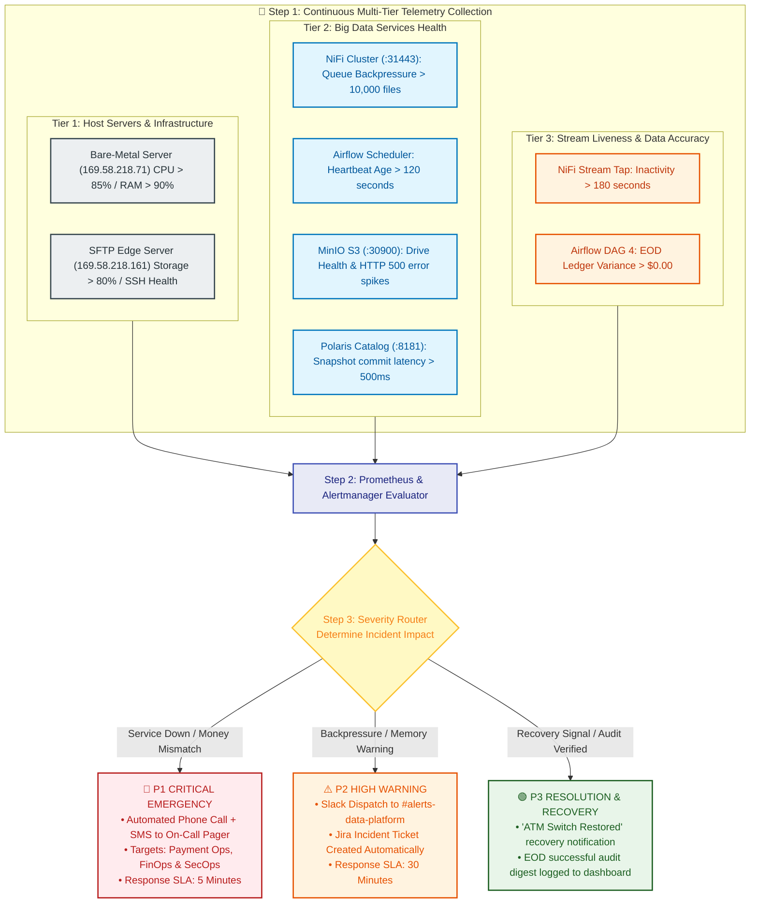

---

### 5.1 Automated Incident Escalation Matrix

| Incident Type | Trigger Condition | Detection Mechanism | Severity | Action & Escalation Target |
| :--- | :--- | :--- | :--- | :--- |
| **Payment Switch Down** | No transactions received for > 3 minutes from ATM/POS switch | NiFi `MonitorActivity` generating `inactive` FlowFile | **P1 - Critical** | Instant PagerDuty page to Payment Network Ops & Infrastructure team. |
| **EOD Ledger Mismatch** | Discrepancy > $0.00 between Core Banking Postgres and Lakehouse | Airflow DAG 4 (`perform_eod_reconciliation`) | **P1 - Critical** | Freezes automated financial reporting; alerts Chief Risk Officer and Lead Data Architect. |
| **Airflow Scheduler Down** | Scheduler heartbeat missing for > 120 seconds | Prometheus `airflow_scheduler_heartbeat_age` rule | **P2 - High** | Alerts Kubernetes DevOps to restart Airflow scheduler pod. |
| **NiFi Queue Backpressure** | Queue between Transform and Load exceeds 10,000 FlowFiles | NiFi Connection Warning Threshold & Prometheus | **P2 - High** | Scales up NiFi worker threads or unfreezes downstream Iceberg catalog. |
| **Storage Disk Space Low** | MinIO storage pool capacity > 85% | MinIO Prometheus Metrics (`minio_disk_used_bytes`) | **P2 - High** | Triggers automated snapshot expiry (`DAG 3`) and notifies Storage Admin. |
| **Pipeline Recovered** | First transaction arrives after outage | NiFi `MonitorActivity` (`activity.restored`) | **P3 - Info** | Sends resolution notice to ops channel: *"ATM switch traffic resumed."* |

---

## 6. Incident Lifecycle & Automated Reconciliation Workflow

This workflow diagram illustrates what happens when an upstream banking switch stalls, triggers an emergency alert, recovers, and undergoes nightly financial reconciliation:

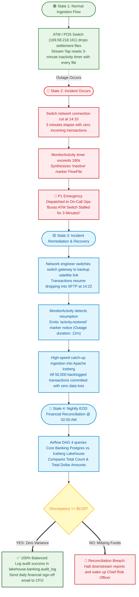

---

---

## 7. Deep Production Example 1: Real-Time Bank Fraud & AML Surveillance System

In a global financial group like **Dahabshiil**, thousands of cross-border remittances (from London, Dubai, Minneapolis) and e-Dahab mobile transactions are processed every minute. Central Banks, the UN, and OFAC require **sub-second sanctions screening and fraud prevention** before funds are disbursed at branches or transferred between mobile wallets.

### 7.1 Architecture of the Real-Time Fraud & AML Subsystem

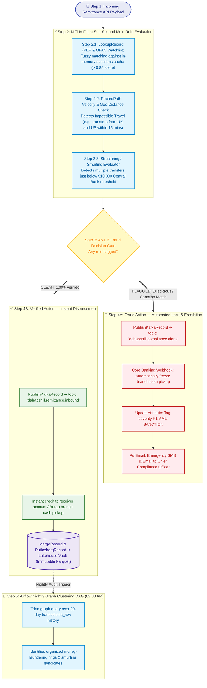

### 7.2 Core Banking Sanctions & Structuring Rules
1. **Watchlist Match**: Fuzzy score $\ge 0.85$ against OFAC SDN, UN Consolidated List, and Central Bank PEPs routes instantly to `dahabshiil.compliance.alerts`.
2. **Structuring / Smurfing Threshold**: Repeated transactions between $\$9,000$ and $\$9,999$ by the same sender or beneficiary within a rolling 72-hour window are quarantined.
3. **Impossible Velocity**: Transactions initiated from IP addresses separated by $> 500$ km within $< 30$ minutes generate an instant account hold.

---

## 8. Deep Production Example 2: 24/7 Server & Service Sentinel (Self-Healing & Multi-Tier Alerting)

In an enterprise banking environment, infrastructure failures (e.g. disk exhaustion on MinIO, thread deadlocks in NiFi, or OOM crashes in Trino) can bring down entire payment gateways. The **Bank Sentinel** couples **Prometheus metric scraping** with **automated Kubernetes self-healing** and multi-channel incident response.

### 8.1 Architecture of the Server Sentinel & Self-Healing Workflow

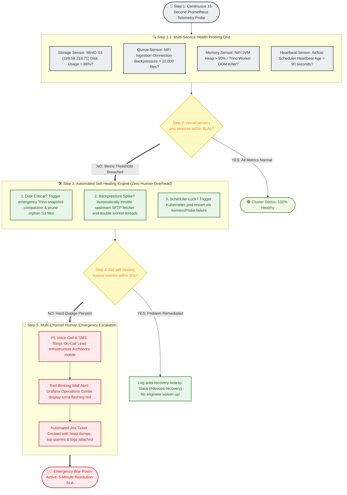

### 8.2 Prometheus Alerting Rules for Banking Infrastructure (`prometheus-rules.yaml`)

```yaml
apiVersion: monitoring.coreos.com/v1
kind: PrometheusRule
metadata:
  name: bank-platform-sentinel-rules
  namespace: samo
spec:
  groups:
  - name: bank-infrastructure-alerts
    rules:
    # Alert 1: MinIO Disk Exhaustion
    - alert: MinIODiskSpaceCritical
      expr: (minio_disk_used_bytes / minio_disk_total_bytes) * 100 > 88
      for: 2m
      labels:
        severity: critical
      annotations:
        summary: "MinIO S3 storage pool exceeds 88% capacity on {{ $labels.instance }}"
        action: "Trigger automated snapshot compaction or expand PV volume."

    # Alert 2: NiFi Queue Backpressure Spike
    - alert: NiFiQueueBackpressureCritical
      expr: nifi_queue_size > 10000
      for: 1m
      labels:
        severity: warning
      annotations:
        summary: "NiFi ingestion queue congested: {{ $value }} FlowFiles waiting."

    # Alert 3: Airflow Scheduler Deadlock
    - alert: AirflowSchedulerHeartbeatLost
      expr: time() - airflow_scheduler_heartbeat_timestamp > 90
      for: 1m
      labels:
        severity: critical
      annotations:
        summary: "Airflow Scheduler unresponsive for > 90 seconds. Restarting pod."
```

---

## 9. Step-by-Step Guide: How to Explain This Architecture to Someone

When presenting this architecture to an interviewer, customer, or executive, structure your explanation using the **5-Pillar Walkthrough Framework**:

```text
┌───────────────────────────────────────────────────────────────────────────────────┐
│                     THE 5-PILLAR ARCHITECTURAL WALKTHROUGH                        │
│                                                                                   │
│  1. Business Problem & Regulatory Requirements                                    │
│  2. Ingestion Design & The 5-Group Encapsulation Law                              │
│  3. Storage Optimization & The Small-Files Solution                               │
│  4. Orchestration, GitOps & Idempotent Auditing                                   │
│  5. Proactive Observability & Incident Response                                   │
└───────────────────────────────────────────────────────────────────────────────────┘
```

### Pillar 1: Start with the Business Context (Why this design matters)
* **What to say**: *"In a bank like Dahabshiil, data engineering isn't just about moving files. We process customer deposits, remittances, and ATM transactions. A single dropped record means a customer's money is lost or a regulatory audit fails. That is why our pipeline is built with zero-loss guarantees, immutable audit trails, and automated cross-system reconciliations."*

### Pillar 2: Explain the Lab 4 Ingestion Architecture
* **What to say**: *"Instead of building a fragile, monolithic pipeline, we implemented a modular 5-group design in Apache NiFi: Extract, Transform, Load, Monitoring, and Alerting. All communication happens strictly through Input and Output ports.*
* *In **Extract**, we run `ListSFTP` only on the Primary Node to avoid duplicate downloads, and use Round-Robin load balancing across the cluster.*
* *In **Transform**, we convert CSV into binary Avro in-flight and extract event dates using RecordPath rather than arrival filenames, avoiding date boundary errors.*
* *In **Load**, we bin-pack up to 250,000 records correlated on partition dates before committing to Apache Iceberg via the Polaris REST Catalog."*

### Pillar 3: Highlight the Stream Tapping & Fraud Surveillance Innovation
* **What to say**: *"A major innovation here is **Non-Intrusive Stream Tapping**. Instead of putting monitoring processors directly in the transaction path—where any failure could freeze the entire bank—we clone the metadata stream at `FetchSFTP`. The monitoring group evaluates traffic volume in parallel. If transaction traffic stops for more than 3 minutes, it autonomously fires a P1 incident alert.*
* *Simultaneously, in-flight transactions undergo real-time AML and sanctions screening. Flagged transfers are quarantined in Kafka and frozen before funds are disbursed, while clean records flow immediately into Iceberg."*

### Pillar 4: Explain Airflow's Strategic Role
* **What to say**: *"NiFi handles streaming, but Apache Airflow is our operational brain. Airflow runs 4 critical production DAGs:
  1. Nightly aggregation of millions of transactions into branch reporting rollups.
  2. Syncing aggregated marts into PostgreSQL using an idempotent 'Delete-Then-Insert' pattern.
  3. Weekly Iceberg maintenance—compacting files into 128MB splits and expiring snapshots.
  4. Our End-of-Day Cross-System Reconciliation audit, which compares Core Banking database balances against the Lakehouse and raises an alarm if a single cent is missing."*

### Pillar 5: Wrap up with Self-Healing Infrastructure & GitOps Governance
* **What to say**: *"All DAGs are deployed through a secure GitLab CI/CD GitOps workflow with `git-sync` sidecars in Kubernetes—no manual SSH modifications. Secrets are centralized in Airflow connections, and our 24/7 Sentinel automatically heals memory and disk spikes before waking up on-call engineers."*

---

## 10. Cross-Platform Operations & Emergency Troubleshooting Matrix

When operating this live banking platform, reference this quick-response cheat sheet for common issues:

| # | Symptom | Immediate Root Cause | Exact Production Resolution |
| :--- | :--- | :--- | :--- |
| **1** | `UpdateRecord writes literal formula string` | `Replacement Value Strategy` set to `Literal Value`. | Edit processor -> Switch `Replacement Value Strategy` to **`Record Path Value`**. |
| **2** | `PutIcebergRecord: Unmatched Column Behavior FAIL` | Avro schema in Schema Registry missing fields present in Iceberg table. | Register updated Avro schema (`bank-tx-partitioned`) matching Iceberg table definition. |
| **3** | `Duplicate transactions ingested from SFTP` | `ListSFTP` scheduled on `All Nodes`. | Open `ListSFTP` -> Scheduling tab -> Set **Execution: `On Primary Node`**. |
| **4** | `Primary node CPU 100%, workers idle` | Missing queue load balancing after `ListSFTP`. | Open connection `ListSFTP ➔ FetchSFTP` -> Settings -> Set **Load Balance Strategy: `Round Robin`**. |
| **5** | `MinIO 400 Bad Request / Path error` | Client attempting virtual-host S3 addressing. | In `S3IcebergFileIOProvider`, set **`Path Style Access: true`**. |
| **6** | `Polaris Catalog 401 Unauthorized` | OAuth2 client secret rotated or token expired. | Update client secret in `lakehouse.properties` and verify `samo_polaris` Postgres connectivity. |
| **7** | `MonitorActivity sending false quiet alerts` | Processor running on worker node with no traffic or threshold too tight. | Set `Execution: On Primary Node` and ensure `Threshold Duration` is 2x normal file drop interval. |
| **8** | `Airflow TrinoOperator: Connection Refused` | Connection host pointing to localhost instead of Kubernetes service. | Update Airflow connection host to `trino.samo.svc.cluster.local` and port `8080`. |
| **9** | `Iceberg CommitFailedException (Conflict)` | Concurrent writers attempting to update table snapshot simultaneously. | Ensure write operations serialize through NiFi queue or implement retry backoff. |
| **10**| `DAG not refreshing in Airflow Web UI` | Python syntax error or git-sync sidecar failed. | Run `python3 dags/my_dag.py` in container to test syntax; verify `kubectl logs -n samo -l app=airflow -c git-sync`. |

---

*Authored for Telesom & Dahabshiil Group — Big Data Platform Engineering.*  
*Production Architecture Document — Lab 4 Ingestion, Lakehouse Storage & Airflow Orchestration.*

