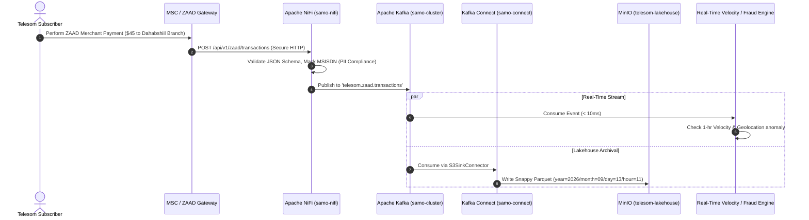
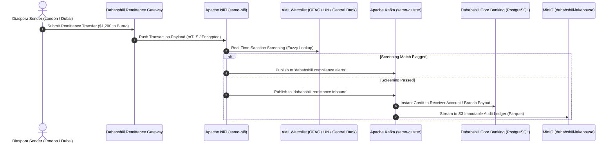

# Samo Data Platform — Master Guidance Book & Architecture Blueprint
**Version:** 1.0  
**Target Environment:** Kubernetes (`samo` namespace)  
**Target Industries:** Telecommunications (Telesom) & Banking / Remittance (Dahabshiil Bank)  
**Authors:** Data Platform Engineering Team

---

## Table of Contents
1. [Executive Summary & Enterprise Architecture](#1-executive-summary--enterprise-architecture)
2. [Component Roles & Technology Stack](#2-component-roles--technology-stack)
3. [Network, Ports & Security Blueprint](#3-network-ports--security-blueprint)
4. [Step-by-Step Platform Setup & Manifests](#4-step-by-step-platform-setup--manifests)
   - [Step 4.1: Dedicated Namespace `samo`](#step-41-dedicated-namespace-samo)
   - [Step 4.2: Storage Configuration (`local-path`)](#step-42-storage-configuration-local-path)
   - [Step 4.3: Apache Kafka Deployment (Strimzi KRaft)](#step-43-apache-kafka-deployment-strimzi-kraft)
   - [Step 4.4: MinIO S3 Object Storage Deployment](#step-44-minio-s3-object-storage-deployment)
   - [Step 4.5: Kafka Connect & Connector Ecosystem](#step-45-kafka-connect--connector-ecosystem)
   - [Step 4.6: Apache NiFi Enterprise Deployment](#step-46-apache-nifi-enterprise-deployment)
   - [Step 4.7: Kafka Web UI Integration (AKHQ)](#step-47-kafka-web-ui-integration-akhq)
5. [Industry Use Case 1: Telesom Telecommunications & ZAAD Mobile Money](#5-industry-use-case-1-telesom-telecommunications--zaad-mobile-money)
   - [5.1 Telecom CDR Real-Time Streaming & Network QoS](#51-telecom-cdr-real-time-streaming--network-qos)
   - [5.2 ZAAD Mobile Money Real-Time Fraud & Velocity Detection](#52-zaad-mobile-money-real-time-fraud--velocity-detection)
   - [5.3 Telesom Long-Term Parquet Lakehouse on MinIO](#53-telesom-long-term-parquet-lakehouse-on-minio)
6. [Industry Use Case 2: Dahabshiil Bank & International Remittance](#6-industry-use-case-2-dahabshiil-bank--international-remittance)
   - [6.1 Real-Time Cross-Border Remittance & AML Screening](#61-real-time-cross-border-remittance--aml-screening)
   - [6.2 Core Banking Change Data Capture (CDC) with Kafka Connect](#62-core-banking-change-data-capture-cdc-with-kafka-connect)
   - [6.3 Financial Audit & Immutable Regulatory Lakehouse](#63-financial-audit--immutable-regulatory-lakehouse)
7. [Step-by-Step Functional Verification & End-to-End Testing](#7-step-by-step-functional-verification--end-to-end-testing)
8. [Production Operations, Disaster Recovery & Troubleshooting](#8-production-operations-disaster-recovery--troubleshooting)
9. [Operations & CLI Cheat Sheet](#9-operations--cli-cheat-sheet)

---

## 1. Executive Summary & Enterprise Architecture

The **Samo Data Platform** is a secure, cloud-native, real-time data streaming and lakehouse infrastructure running inside Kubernetes under the dedicated namespace `samo`. 

Designed as a modern financial and telecommunication event broker and storage layer, the platform decouples producers (core telecom nodes, MSC/SGW switches, core banking engines, digital mobile wallets) from downstream analytical and transactional consumers (data warehouses, fraud detection engines, AML compliance services, AI/ML scoring models, regulatory auditors).

```mermaid
flowchart TB
    subgraph INGESTION["Edge & Source Ingestion"]
        T1["Telesom MSC / PGW / GGSN\n(CDRs / USSD / Data)"]
        T2["ZAAD Mobile Money API\n(P2P, Merchant, Cash-In)"]
        D1["Dahabshiil Remittance Inbound\n(SWIFT, API, Agent Terminals)"]
        D2["Dahabshiil Core Banking\n(PostgreSQL / Oracle CDC)"]
    end

    subgraph SAMO_NS["Kubernetes: samo Namespace"]
        subgraph NIFI_LAYER["Orchestration & ETL Layer"]
            NIFI["Apache NiFi 2.9.0\n(samo-nifi)\nPort 31443 (HTTPS)"]
        end

        subgraph KAFKA_LAYER["Message Bus & Streaming Layer"]
            KAFKA["Apache Kafka 4.2.0 (KRaft)\n(samo-cluster)\nPort 9092 (Internal) / 32010 (NodePort)"]
            TOPICS["Topics:\ntelesom.cdrs.voice\ntelesom.zaad.tx\ndahabshiil.remittance\ndahabshiil.corebanking.cdc"]
        end

        subgraph CONNECT_LAYER["Integration & Sink Layer"]
            CONNECT["Kafka Connect\n(samo-connect)\nS3 Sink & JDBC Connectors"]
        end

        subgraph STORAGE_LAYER["Object Storage & Lakehouse"]
            MINIO["MinIO S3 Object Store\n(samo-minio)\nPort 30900 (S3) / 30901 (Console)\nBuckets: telesom-lakehouse, dahabshiil-lakehouse"]
        end

        subgraph MANAGEMENT["Observability & Management"]
            AKHQ["AKHQ Web UI\n(samo-akhq)\nTopic & Consumer Visibility"]
        end
    end

    subgraph CONSUMPTION["Downstream Real-Time & Analytical Consumers"]
        FRAUD["Real-Time Fraud Engine\n(AML / Velocity Alerts)"]
        TRINO["Trino / Spark SQL Query Engine\n(OpenSearch / Parquet Analytics)"]
        REPORTS["Central Bank Regulatory Reports\n(Financial Audits & CDR Archive)"]
    end

    T1 -->|HTTP/REST / Syslog| NIFI
    T2 -->|JSON Webhooks| NIFI
    D1 -->|ISO20022 / JSON| NIFI
    D2 -->|CDC WAL / JDBC| CONNECT

    NIFI -->|Publish Record| KAFKA
    KAFKA --> CONNECT
    CONNECT -->|Parquet Batches| MINIO
    KAFKA -->|Real-Time Subscribe| FRAUD
    MINIO -->|S3 Lakehouse Tables| TRINO
    MINIO -->|Immutable Store| REPORTS
    KAFKA -.->|Admin & Inspect| AKHQ
```



---

## 2. Component Roles & Technology Stack

| Component | Technology | Version | Purpose in `samo` Platform |
| :--- | :--- | :--- | :--- |
| **Data Ingestion & ETL** | Apache NiFi | `2.9.0` | Ingests data from telecom switches, REST APIs, SFTP, and databases. Handles record parsing, enrichment, PII masking, routing, and schema translation. |
| **Event Streaming Engine** | Apache Kafka | `4.2.0` | Central nervous system for high-throughput, low-latency, ordered event streams with KRaft metadata (no ZooKeeper required). |
| **Data Lakehouse Sink** | Kafka Connect | `4.2.0` | Automatically streams Kafka events into MinIO S3 as Snappy-compressed Parquet files and connects to relational database sources/sinks. |
| **Object Store / Lakehouse** | MinIO | `RELEASE.2024-12-18` | High-performance S3-compatible object store acting as the Bronze, Silver, and Gold Data Lake for CDRs, audit logs, and banking ledgers. |
| **Kafka Management Console** | AKHQ | `0.28.0` | Web-based operational console for Kafka topic management, schema browsing, consumer lag tracking, and live message inspection. |
| **Underlying Orchestrator** | Kubernetes | `v1.34.6` | Container orchestration engine running on Rocky Linux 9.8 workers with `rancher.io/local-path` persistent storage. |

---

## 3. Network, Ports & Security Blueprint

### 3.1 Network Isolation Principle
All intra-platform communication between NiFi, Kafka, Kafka Connect, and MinIO uses **Kubernetes Internal DNS** (`*.samo.svc.cluster.local`). Traffic stays within the private SDN without going through external interfaces.

### 3.2 NodePort Allocation Matrix

| Service | Internal Cluster IP Port | External NodePort | Protocol | Access Method & URL |
| :--- | :--- | :--- | :--- | :--- |
| **Kafka External Bootstrap** | `9094` | `32010` | PLAINTEXT | `169.58.218.71:32010` (Edge / External Producer Access) |
| **Kafka Broker 0** | `9094` | `32011` | PLAINTEXT | `169.58.218.71:32011` (Direct Broker Route) |
| **MinIO S3 API** | `9000` | `30900` | HTTP | `http://169.58.218.71:30900` (S3 SDK / CLI / Spark) |
| **MinIO Web Console** | `9001` | `30901` | HTTP | `http://169.58.218.71:30901` (Web Browser UI) |
| **NiFi HTTPS Web UI** | `8443` | `31443` | HTTPS | `https://169.58.218.71:31443/nifi` (NiFi Canvas) |
| **NiFi Site-to-Site (S2S)** | `10000` | `31000` | RAW / HTTP | `169.58.218.71:31000` (NiFi-to-NiFi Remote Process Groups) |
| **NiFi Prometheus Metrics** | `9090` | `31090` | HTTP | `http://samo-nifi.samo.svc:9090` (Scraped by Prometheus) |

### 3.3 Internal DNS Addresses
- Kafka Bootstrap: `samo-cluster-kafka-bootstrap.samo.svc.cluster.local:9092`
- MinIO S3 API: `http://samo-minio.samo.svc.cluster.local:9000`
- MinIO Web Console: `http://samo-minio.samo.svc.cluster.local:9001`
- Kafka Connect REST API: `http://samo-connect-connect-api.samo.svc.cluster.local:8083`
- NiFi Service: `https://samo-nifi.samo.svc.cluster.local:8443`

---

## 4. Step-by-Step Platform Setup & Manifests

### Step 4.1: Dedicated Namespace `samo`

Create the isolated namespace. This guarantees complete sandboxing from `mathew`, `nifi`, or any other workspace:

```bash
kubectl apply -f - <<'EOF'
apiVersion: v1
kind: Namespace
metadata:
  name: samo
  labels:
    environment: production
    managed-by: samo-data-platform
EOF
```

---

### Step 4.2: Storage Configuration (`local-path`)

The cluster uses `rancher.io/local-path` with `VolumeBindingMode: WaitForFirstConsumer`. When pods are scheduled on worker `node4`, PVs will automatically bind to the local high-speed SSD storage on `node4`.

---

### Step 4.3: Apache Kafka Deployment (Strimzi KRaft)

We deploy Kafka 4.2.0 in combined controller/broker (dual-role) mode. This eliminates ZooKeeper overhead and uses KRaft metadata management.

#### 1. KafkaNodePool Manifest (`samo/dual-role`)
```bash
kubectl apply -f - <<'EOF'
apiVersion: kafka.strimzi.io/v1
kind: KafkaNodePool
metadata:
  name: dual-role
  namespace: samo
  labels:
    strimzi.io/cluster: samo-cluster
spec:
  replicas: 1
  roles:
    - controller
    - broker
  storage:
    type: jbod
    volumes:
      - id: 0
        type: persistent-claim
        size: 10Gi
        deleteClaim: false
        class: local-path
  resources:
    requests:
      cpu: 500m
      memory: 1Gi
    limits:
      cpu: "1"
      memory: 2Gi
  template:
    pod:
      affinity:
        nodeAffinity:
          preferredDuringSchedulingIgnoredDuringExecution:
            - weight: 100
              preference:
                matchExpressions:
                  - key: kubernetes.io/hostname
                    operator: In
                    values:
                      - node4
EOF
```

#### 2. Kafka Cluster Manifest (`samo/samo-cluster`)
```bash
kubectl apply -f - <<'EOF'
apiVersion: kafka.strimzi.io/v1
kind: Kafka
metadata:
  name: samo-cluster
  namespace: samo
spec:
  kafka:
    version: 4.2.0
    metadataVersion: 4.2-IV1
    config:
      default.replication.factor: 1
      offsets.topic.replication.factor: 1
      transaction.state.log.replication.factor: 1
      transaction.state.log.min.isr: 1
      min.insync.replicas: 1
      log.retention.hours: 168
      log.retention.bytes: 10737418240
      compression.type: producer
    listeners:
      - name: plain
        port: 9092
        type: internal
        tls: false
      - name: external
        port: 9094
        type: nodeport
        tls: false
        configuration:
          bootstrap:
            nodePort: 32010
          brokers:
            - broker: 0
              nodePort: 32011
  entityOperator:
    topicOperator: {}
    userOperator: {}
EOF
```

---

### Step 4.4: MinIO S3 Object Storage Deployment

MinIO provides S3-compatible data lake storage.

#### 1. MinIO Credentials Secret
```bash
kubectl apply -f - <<'EOF'
apiVersion: v1
kind: Secret
metadata:
  name: samo-minio-credentials
  namespace: samo
type: Opaque
stringData:
  rootUser: "samo-admin"
  rootPassword: "SamoSecureMinioPass2026!"
  accesskey: "samo-admin"
  secretkey: "SamoSecureMinioPass2026!"
EOF
```

#### 2. MinIO PersistentVolumeClaim (15Gi)
```bash
kubectl apply -f - <<'EOF'
apiVersion: v1
kind: PersistentVolumeClaim
metadata:
  name: samo-minio-pvc
  namespace: samo
spec:
  accessModes:
    - ReadWriteOnce
  storageClassName: local-path
  resources:
    requests:
      storage: 15Gi
EOF
```

#### 3. MinIO Deployment & Service
```bash
kubectl apply -f - <<'EOF'
apiVersion: apps/v1
kind: Deployment
metadata:
  name: samo-minio
  namespace: samo
  labels:
    app: samo-minio
spec:
  replicas: 1
  selector:
    matchLabels:
      app: samo-minio
  template:
    metadata:
      labels:
        app: samo-minio
    spec:
      nodeSelector:
        kubernetes.io/hostname: node4
      containers:
        - name: minio
          image: quay.io/minio/minio:RELEASE.2024-12-18T13-15-44Z
          command:
            - /bin/sh
            - -ce
            - "minio server /export --address :9000 --console-address :9001"
          env:
            - name: MINIO_ROOT_USER
              valueFrom:
                secretKeyRef:
                  name: samo-minio-credentials
                  key: rootUser
            - name: MINIO_ROOT_PASSWORD
              valueFrom:
                secretKeyRef:
                  name: samo-minio-credentials
                  key: rootPassword
            - name: MINIO_PROMETHEUS_AUTH_TYPE
              value: public
          ports:
            - containerPort: 9000
              name: s3-api
            - containerPort: 9001
              name: s3-console
          resources:
            requests:
              cpu: 250m
              memory: 512Mi
            limits:
              cpu: "1"
              memory: 1Gi
          volumeMounts:
            - name: data
              mountPath: /export
      volumes:
        - name: data
          persistentVolumeClaim:
            claimName: samo-minio-pvc
---
apiVersion: v1
kind: Service
metadata:
  name: samo-minio
  namespace: samo
  labels:
    app: samo-minio
spec:
  type: NodePort
  selector:
    app: samo-minio
  ports:
    - name: s3-api
      port: 9000
      targetPort: 9000
      nodePort: 30900
    - name: s3-console
      port: 9001
      targetPort: 9001
      nodePort: 30901
EOF
```

---

### Step 4.5: Kafka Connect & Connector Ecosystem

Deploy Kafka Connect with connectors for S3/MinIO, JDBC (Core Banking), and File streams.

#### 1. S3 Secret for Kafka Connect
```bash
kubectl apply -f - <<'EOF'
apiVersion: v1
kind: Secret
metadata:
  name: samo-s3-creds
  namespace: samo
type: Opaque
stringData:
  accesskey: "samo-admin"
  secretkey: "SamoSecureMinioPass2026!"
EOF
```

#### 2. KafkaConnect Instance (`samo/samo-connect`)
```bash
kubectl apply -f - <<'EOF'
apiVersion: kafka.strimzi.io/v1
kind: KafkaConnect
metadata:
  name: samo-connect
  namespace: samo
  annotations:
    strimzi.io/use-connector-resources: "true"
spec:
  version: 4.2.0
  replicas: 1
  bootstrapServers: samo-cluster-kafka-bootstrap.samo.svc:9092
  image: ttl.sh/strimzi-connect-example-4.2.0@sha256:22eac2ea91ee7b0456db7ea20d94dd3c4560264062421050e56d311d96169397
  groupId: samo-connect-group
  configStorageTopic: samo-connect-configs
  offsetStorageTopic: samo-connect-offsets
  statusStorageTopic: samo-connect-status
  config:
    config.storage.replication.factor: -1
    offset.storage.replication.factor: -1
    status.storage.replication.factor: -1
  resources:
    requests:
      cpu: 250m
      memory: 512Mi
    limits:
      cpu: "1"
      memory: 1Gi
  template:
    pod:
      affinity:
        nodeAffinity:
          preferredDuringSchedulingIgnoredDuringExecution:
            - weight: 100
              preference:
                matchExpressions:
                  - key: kubernetes.io/hostname
                    operator: In
                    values:
                      - node4
    connectContainer:
      env:
        - name: AWS_ACCESS_KEY_ID
          valueFrom:
            secretKeyRef:
              name: samo-s3-creds
              key: accesskey
        - name: AWS_SECRET_ACCESS_KEY
          valueFrom:
            secretKeyRef:
              name: samo-s3-creds
              key: secretkey
EOF
```

---

### Step 4.6: Apache NiFi Enterprise Deployment

Apache NiFi is deployed as an independent StatefulSet with its own dedicated storage volumes, ensuring strict data durability and complete independence from `nifi/nifikop`.

#### 1. NiFi Credentials & Sensitive Properties Secret
```bash
kubectl apply -f - <<'EOF'
apiVersion: v1
kind: Secret
metadata:
  name: samo-nifi-credentials
  namespace: samo
type: Opaque
stringData:
  username: "samo-admin"
  password: "SamoNiFiPassword2026!"
  sensitivePropsKey: "SamoEnterpriseNiFiSecureKey32Ch"
EOF
```

#### 2. NiFi Persistent Volumes (14Gi total across 6 dedicated repositories)
```bash
kubectl apply -f - <<'EOF'
apiVersion: v1
kind: PersistentVolumeClaim
metadata:
  name: nifi-logs-pvc
  namespace: samo
spec:
  accessModes: [ReadWriteOnce]
  storageClassName: local-path
  resources: { requests: { storage: 2Gi } }
---
apiVersion: v1
kind: PersistentVolumeClaim
metadata:
  name: nifi-flowfile-pvc
  namespace: samo
spec:
  accessModes: [ReadWriteOnce]
  storageClassName: local-path
  resources: { requests: { storage: 2Gi } }
---
apiVersion: v1
kind: PersistentVolumeClaim
metadata:
  name: nifi-content-pvc
  namespace: samo
spec:
  accessModes: [ReadWriteOnce]
  storageClassName: local-path
  resources: { requests: { storage: 5Gi } }
---
apiVersion: v1
kind: PersistentVolumeClaim
metadata:
  name: nifi-provenance-pvc
  namespace: samo
spec:
  accessModes: [ReadWriteOnce]
  storageClassName: local-path
  resources: { requests: { storage: 2Gi } }
---
apiVersion: v1
kind: PersistentVolumeClaim
metadata:
  name: nifi-database-pvc
  namespace: samo
spec:
  accessModes: [ReadWriteOnce]
  storageClassName: local-path
  resources: { requests: { storage: 2Gi } }
---
apiVersion: v1
kind: PersistentVolumeClaim
metadata:
  name: nifi-state-pvc
  namespace: samo
spec:
  accessModes: [ReadWriteOnce]
  storageClassName: local-path
  resources: { requests: { storage: 1Gi } }
EOF
```

#### 3. NiFi StatefulSet & NodePort Service
```bash
kubectl apply -f - <<'EOF'
apiVersion: apps/v1
kind: StatefulSet
metadata:
  name: samo-nifi
  namespace: samo
  labels:
    app: samo-nifi
spec:
  serviceName: samo-nifi
  replicas: 1
  selector:
    matchLabels:
      app: samo-nifi
  template:
    metadata:
      labels:
        app: samo-nifi
    spec:
      nodeSelector:
        kubernetes.io/hostname: node4
      containers:
        - name: nifi
          image: apache/nifi:2.9.0
          ports:
            - containerPort: 8443
              name: https
            - containerPort: 10000
              name: s2s
            - containerPort: 9090
              name: prometheus
          env:
            - name: SINGLE_USER_CREDENTIALS_USERNAME
              valueFrom:
                secretKeyRef:
                  name: samo-nifi-credentials
                  key: username
            - name: SINGLE_USER_CREDENTIALS_PASSWORD
              valueFrom:
                secretKeyRef:
                  name: samo-nifi-credentials
                  key: password
            - name: NIFI_SENSITIVE_PROPS_KEY
              valueFrom:
                secretKeyRef:
                  name: samo-nifi-credentials
                  key: sensitivePropsKey
            - name: NIFI_WEB_HTTPS_PORT
              value: "8443"
            - name: NIFI_WEB_PROXY_HOST
              value: "169.58.218.71:31443,169.58.218.161:31443,samo-nifi:8443,samo-nifi.samo.svc.cluster.local:8443"
            - name: NIFI_JVM_HEAP_INIT
              value: "1g"
            - name: NIFI_JVM_HEAP_MAX
              value: "2g"
          resources:
            requests:
              cpu: 500m
              memory: 2Gi
            limits:
              cpu: "2"
              memory: 4Gi
          volumeMounts:
            - name: logs-vol
              mountPath: /opt/nifi/nifi-current/logs
            - name: flowfile-vol
              mountPath: /opt/nifi/nifi-current/flowfile_repository
            - name: content-vol
              mountPath: /opt/nifi/nifi-current/content_repository
            - name: provenance-vol
              mountPath: /opt/nifi/nifi-current/provenance_repository
            - name: database-vol
              mountPath: /opt/nifi/nifi-current/database_repository
            - name: state-vol
              mountPath: /opt/nifi/nifi-current/state
      volumes:
        - name: logs-vol
          persistentVolumeClaim:
            claimName: nifi-logs-pvc
        - name: flowfile-vol
          persistentVolumeClaim:
            claimName: nifi-flowfile-pvc
        - name: content-vol
          persistentVolumeClaim:
            claimName: nifi-content-pvc
        - name: provenance-vol
          persistentVolumeClaim:
            claimName: nifi-provenance-pvc
        - name: database-vol
          persistentVolumeClaim:
            claimName: nifi-database-pvc
        - name: state-vol
          persistentVolumeClaim:
            claimName: nifi-state-pvc
---
apiVersion: v1
kind: Service
metadata:
  name: samo-nifi
  namespace: samo
  labels:
    app: samo-nifi
spec:
  type: NodePort
  selector:
    app: samo-nifi
  ports:
    - name: https
      port: 8443
      targetPort: 8443
      nodePort: 31443
    - name: s2s
      port: 10000
      targetPort: 10000
      nodePort: 31000
    - name: prometheus
      port: 9090
      targetPort: 9090
      nodePort: 31090
EOF
```

---

### Step 4.7: Kafka Web UI Integration (AKHQ)

The namespace `samo-akhq` is already pre-configured to point to:
`bootstrap.servers: samo-cluster-kafka-bootstrap.samo.svc:9092`.
As soon as `samo-cluster` is deployed, AKHQ automatically discovers all topics, consumer groups, and partitions in real time!

---

## 5. Industry Use Case 1: Telesom Telecommunications & ZAAD Mobile Money

**Telesom** is Somaliland’s largest telecommunications company, serving millions with GSM mobile voice, 4G/5G mobile data, and the **ZAAD Service** mobile money ecosystem.



### 5.1 Telecom CDR Real-Time Streaming & Network QoS

Telecom switches generate billions of Call Detail Records (CDRs) for Voice, SMS, and Data sessions.

#### 1. Dedicated Kafka Topics for Telesom
```bash
kubectl apply -f - <<'EOF'
apiVersion: kafka.strimzi.io/v1
kind: KafkaTopic
metadata:
  name: telesom.cdrs.voice
  namespace: samo
  labels:
    strimzi.io/cluster: samo-cluster
spec:
  partitions: 3
  replicas: 1
  config:
    retention.ms: 604800000 # 7 days
    cleanup.policy: delete
---
apiVersion: kafka.strimzi.io/v1
kind: KafkaTopic
metadata:
  name: telesom.cdrs.data
  namespace: samo
  labels:
    strimzi.io/cluster: samo-cluster
spec:
  partitions: 3
  replicas: 1
  config:
    retention.ms: 604800000
    cleanup.policy: delete
EOF
```

#### 2. Sample Telesom CDR Payload (Voice / VoLTE)
```json
{
  "cdr_id": "TEL-V-20260913-09881234",
  "record_type": "CALL_TERMINATING",
  "caller_msisdn": "252634451234",
  "callee_msisdn": "252634498765",
  "call_start_time": "2026-09-13T11:15:02.123+03:00",
  "call_end_time": "2026-09-13T11:18:45.890+03:00",
  "duration_seconds": 223,
  "disconnect_reason": "NORMAL_CLEARING",
  "cell_tower_id": "HGA-CENTRAL-04A",
  "bts_location": {
    "city": "Hargeisa",
    "district": "26 June",
    "latitude": 9.5623,
    "longitude": 44.0570
  },
  "rat_type": "4G_VOLTE",
  "qos_packet_loss_percent": 0.02,
  "rated_units_usd": 0.1115
}
```

#### 3. NiFi Flow Configuration for Ingesting Telesom CDRs
1. **Processor 1: `ListenHTTP`**
   - Listening Port: `8088` (or ingestion via SFTP from MSC switches using `GetSFTP`)
   - Base Path: `telesom/cdrs`
2. **Processor 2: `ValidateJson` & `JoltTransformJSON`**
   - Strips non-standard switch headers.
   - Enriches with Somali Country Code (`+252`) and cleanses phone numbers into standard E.164.
3. **Processor 3: `PublishKafkaRecord_2_6`**
   - Kafka Brokers: `samo-cluster-kafka-bootstrap.samo.svc:9092`
   - Topic Name: `telesom.cdrs.voice`
   - Record Reader: `JsonTreeReader`
   - Record Writer: `JsonRecordSetWriter` (or Avro)
   - Delivery Guarantee: `Guarantee -1 (all ISRs)`

---

### 5.2 ZAAD Mobile Money Real-Time Fraud & Velocity Detection

The **ZAAD service** processes P2P transfers, merchant payments, salary disbursements, and utility bills. High-velocity transfer fraud (e.g., sudden burst of transfers after SIM swap) requires sub-second detection.

#### 1. Dedicated Kafka Topic for ZAAD
```bash
kubectl apply -f - <<'EOF'
apiVersion: kafka.strimzi.io/v1
kind: KafkaTopic
metadata:
  name: telesom.zaad.transactions
  namespace: samo
  labels:
    strimzi.io/cluster: samo-cluster
spec:
  partitions: 3
  replicas: 1
  config:
    retention.ms: 2592000000 # 30 days
    cleanup.policy: delete
EOF
```

#### 2. Sample ZAAD Mobile Money Transaction Payload
```json
{
  "transaction_id": "ZAAD-TX-9871239841",
  "timestamp": "2026-09-13T11:21:40.000Z",
  "channel": "USSD_*888#",
  "transaction_type": "MERCHANT_PAYMENT",
  "currency": "USD",
  "amount": 45.00,
  "fee": 0.00,
  "sender": {
    "account_number": "252634451234",
    "customer_name": "Axmed Cali Nuur",
    "kyc_tier": "TIER_3_FULL",
    "device_imei": "862349041239871",
    "cell_id": "HGA-DOWNTOWN-01"
  },
  "receiver": {
    "merchant_code": "M-9944",
    "merchant_name": "Dahabshiil Motors Parts Hargeisa",
    "bank_account_linked": "DAHAB-ACC-0012394"
  },
  "security_metadata": {
    "sim_swap_detected_last_24h": false,
    "pin_attempts": 1,
    "ip_address": "197.234.112.5"
  }
}
```

---

### 5.3 Telesom Long-Term Parquet Lakehouse on MinIO

We use **Kafka Connect** to automatically stream all `telesom.cdrs.voice` and `telesom.zaad.transactions` events from Kafka directly into MinIO S3 as partitioned Parquet files.

#### 1. MinIO Bucket Creation
Log into the MinIO Console (`http://169.58.218.71:30901`) or run via `mc`:
```bash
mc alias set samo-minio http://169.58.218.71:30900 samo-admin SamoSecureMinioPass2026!
mc mb samo-minio/telesom-lakehouse
```

#### 2. Kafka Connector Manifest for Telesom Lakehouse Sink
```bash
kubectl apply -f - <<'EOF'
apiVersion: kafka.strimzi.io/v1
kind: KafkaConnector
metadata:
  name: telesom-lakehouse-sink
  namespace: samo
  labels:
    strimzi.io/cluster: samo-connect
spec:
  class: io.confluent.connect.s3.S3SinkConnector
  tasksMax: 2
  config:
    topics: "telesom.cdrs.voice,telesom.zaad.transactions"
    s3.bucket.name: "telesom-lakehouse"
    s3.region: "us-east-1"
    storage.class: "io.confluent.connect.s3.storage.S3Storage"
    store.url: "http://samo-minio.samo.svc.cluster.local:9000"
    format.class: "io.confluent.connect.s3.format.parquet.ParquetFormat"
    parquet.codec: "snappy"
    flush.size: 1000
    rotate.schedule.interval.ms: 60000
    partitioner.class: "io.confluent.connect.storage.partitioner.TimeBasedPartitioner"
    path.format: "'year'=YYYY/'month'=MM/'day'=dd/'hour'=HH"
    partition.duration.ms: 3600000
    timezone: "Africa/Mogadishu"
    locale: "en"
EOF
```

---

## 6. Industry Use Case 2: Dahabshiil Bank & International Remittance

**Dahabshiil** is Africa's largest international money transfer operator and a full-fledged commercial and Islamic bank operating across Somalia, Somaliland, Kenya, the UAE, the UK, and the USA.



### 6.1 Real-Time Cross-Border Remittance & AML Screening

Every incoming transfer from London, Dubai, or Minneapolis must be screened against UN, OFAC, and local sanction lists before funds are disbursed at Dahabshiil branches.

#### 1. Dedicated Kafka Topics for Dahabshiil
```bash
kubectl apply -f - <<'EOF'
apiVersion: kafka.strimzi.io/v1
kind: KafkaTopic
metadata:
  name: dahabshiil.remittance.inbound
  namespace: samo
  labels:
    strimzi.io/cluster: samo-cluster
spec:
  partitions: 3
  replicas: 1
  config:
    retention.ms: 2592000000 # 30 days
---
apiVersion: kafka.strimzi.io/v1
kind: KafkaTopic
metadata:
  name: dahabshiil.compliance.alerts
  namespace: samo
  labels:
    strimzi.io/cluster: samo-cluster
spec:
  partitions: 2
  replicas: 1
  config:
    retention.ms: 31536000000 # 365 days
EOF
```

#### 2. Sample Dahabshiil International Remittance Payload
```json
{
  "remittance_reference": "DHB-REM-20260913-776123",
  "originating_partner": "DAHABSHIIL_UK_LTD",
  "originating_country": "GBR",
  "destination_country": "SOM",
  "source_currency": "GBP",
  "source_amount": 950.00,
  "exchange_rate": 1.3150,
  "payout_currency": "USD",
  "payout_amount": 1249.25,
  "fee_usd": 12.00,
  "sender": {
    "full_name": "Mustafe Jaamac Jaamac",
    "id_type": "UK_PASSPORT",
    "id_number": "UK99881230",
    "dob": "1982-05-14",
    "address": "45 Whitechapel Rd, London E1 1DU, UK",
    "source_of_funds": "EMPLOYMENT_SALARY"
  },
  "beneficiary": {
    "full_name": "Faadumo Axmed Cilmi",
    "phone_number": "252634401122",
    "payout_method": "BRANCH_CASH_PICKUP",
    "payout_branch": "BURAO_CENTRAL_BRANCH",
    "city": "Burao"
  },
  "aml_screening_result": {
    "status": "CLEAR",
    "confidence_score": 0.998,
    "screened_at": "2026-09-13T11:22:15Z"
  }
}
```

#### 3. NiFi Flow for Remittance Routing & AML Alerting
1. **`ListenHTTP`** (Port `8444` / TLS mTLS authenticated):
   - Receives encrypted remittance payload from international gateways.
2. **`LookupRecord` (AML & PEP Screening)**:
   - Queries an in-memory / cache service containing sanctioned entities.
   - If fuzzy matching score > `0.85`, flags transaction as `SUSPICIOUS`.
3. **`RouteOnAttribute`**:
   - `Route to Alert`: If `${aml.status:equals('SUSPICIOUS')}`, routes to `PublishKafkaRecord` -> `dahabshiil.compliance.alerts`.
   - `Route to Normal`: Otherwise routes to `PublishKafkaRecord` -> `dahabshiil.remittance.inbound`.
4. **`EncryptContent`**:
   - Encrypts sensitive PII (Passport numbers, sender addresses) using AES-256-GCM before writing to cold storage.

---

### 6.2 Core Banking Change Data Capture (CDC) with Kafka Connect

Dahabshiil Bank’s core banking engine records account balances, interest-free Murabaha financing, and savings deposits. Kafka Connect streams table changes continuously without impacting database performance.

#### 1. Kafka Connect JDBC Source Connector for Core Banking
```bash
kubectl apply -f - <<'EOF'
apiVersion: kafka.strimzi.io/v1
kind: KafkaConnector
metadata:
  name: dahabshiil-corebanking-source
  namespace: samo
  labels:
    strimzi.io/cluster: samo-connect
spec:
  class: io.confluent.connect.jdbc.JdbcSourceConnector
  tasksMax: 1
  config:
    connection.url: "jdbc:postgresql://postgres.dahabshiil.internal:5432/corebank"
    connection.user: "${strimzienv:PG_USER}"
    connection.password: "${strimzienv:PG_PASSWORD}"
    table.whitelist: "accounts,transactions,fx_ledger"
    mode: "incrementing"
    incrementing.column.name: "transaction_id"
    topic.prefix: "dahabshiil.corebank."
    poll.interval.ms: 5000
EOF
```

---

### 6.3 Financial Audit & Immutable Regulatory Lakehouse

Central Bank compliance requires retaining all transactional ledgers for a minimum of 7 years in an immutable format.

#### 1. MinIO Financial Bucket with Object Locking / Immutability
```bash
mc mb samo-minio/dahabshiil-lakehouse
```

#### 2. Kafka Connect S3 Sink for Dahabshiil
```bash
kubectl apply -f - <<'EOF'
apiVersion: kafka.strimzi.io/v1
kind: KafkaConnector
metadata:
  name: dahabshiil-lakehouse-sink
  namespace: samo
  labels:
    strimzi.io/cluster: samo-connect
spec:
  class: io.confluent.connect.s3.S3SinkConnector
  tasksMax: 2
  config:
    topics: "dahabshiil.remittance.inbound,dahabshiil.compliance.alerts"
    s3.bucket.name: "dahabshiil-lakehouse"
    s3.region: "us-east-1"
    store.url: "http://samo-minio.samo.svc.cluster.local:9000"
    format.class: "io.confluent.connect.s3.format.parquet.ParquetFormat"
    parquet.codec: "snappy"
    flush.size: 500
    rotate.schedule.interval.ms: 60000
    partitioner.class: "io.confluent.connect.storage.partitioner.TimeBasedPartitioner"
    path.format: "'year'=YYYY/'month'=MM/'day'=dd"
    partition.duration.ms: 86400000
    timezone: "UTC"
EOF
```

---

## 7. Step-by-Step Functional Verification & End-to-End Testing

Once manifests are applied, run this sequence to verify the end-to-end flow:

### Step 7.1: Check Pod Health
```bash
kubectl get pods -n samo -o wide
```
*Expected:* `samo-cluster-dual-role-0`, `samo-cluster-entity-operator-*`, `samo-connect-*`, `samo-minio-*`, and `samo-nifi-0` are all in `1/1 Running` state.

### Step 7.2: Verify Kafka Topic Creation & Production
Produce a test Telesom CDR message into Kafka from the command line:
```bash
kubectl run kafka-test-producer -n samo -it --rm --image=quay.io/strimzi/kafka:1.2.0-kafka-4.2.0 --restart=Never -- \
  bin/kafka-console-producer.sh --bootstrap-server samo-cluster-kafka-bootstrap.samo.svc:9092 --topic telesom.cdrs.voice
```
Type or paste:
```text
{"cdr_id":"TEST-001","caller":"252634451234","duration":45}
```

Consume the message back:
```bash
kubectl run kafka-test-consumer -n samo -it --rm --image=quay.io/strimzi/kafka:1.2.0-kafka-4.2.0 --restart=Never -- \
  bin/kafka-console-consumer.sh --bootstrap-server samo-cluster-kafka-bootstrap.samo.svc:9092 --topic telesom.cdrs.voice --from-beginning --max-messages 1
```

### Step 7.3: Verify MinIO S3 API & Console
Check live health:
```bash
curl -I http://169.58.218.71:30900/minio/health/live
```
*Expected:* `HTTP/1.1 200 OK`.

Log in to the Web Console:
- URL: `http://169.58.218.71:30901`
- Username: `samo-admin`
- Password: `SamoSecureMinioPass2026!`

### Step 7.4: Verify NiFi Canvas Access
Access Apache NiFi:
- URL: `https://169.58.218.71:31443/nifi`
- Username: `samo-admin`
- Password: `SamoNiFiPassword2026!`

---

## 8. Production Operations, Disaster Recovery & Troubleshooting

### 8.1 NiFi UI "Invalid SNI / Host Header" Error (HTTP 400)
- **Cause**: NiFi blocks incoming requests if the `Host` HTTP header does not match `nifi.web.proxy.host`.
- **Resolution**: In the NiFi StatefulSet env, ensure all access IPs and hostnames are listed:
  ```yaml
  - name: NIFI_WEB_PROXY_HOST
    value: "169.58.218.71:31443,169.58.218.161:31443,samo-nifi:8443,samo-nifi.samo.svc.cluster.local:8443"
  ```

### 8.2 Kafka Connect S3 403 Forbidden / Signature Does Not Match
- **Cause**: Mismatch between the secret keys in `samo-s3-creds` and MinIO credentials.
- **Resolution**: Confirm secret keys match `samo-minio-credentials`:
  ```bash
  kubectl get secret samo-s3-creds -n samo -o jsonpath='{.data.accesskey}' | base64 -d
  ```

### 8.3 Local-Path Volume Pending / Unschedulable
- **Cause**: Pod requesting more CPU/RAM than available on `node4`, or `local-path` waiting for first consumer.
- **Resolution**: Inspect events:
  ```bash
  kubectl describe pod <pod-name> -n samo
  ```

---

## 9. Operations & CLI Cheat Sheet

### View All Resources in Samo Environment
```bash
kubectl get all,pvc,secret -n samo
```

### Stream NiFi Application Logs
```bash
kubectl logs -f -n samo statefulset/samo-nifi
```

### Stream Kafka Broker Logs
```bash
kubectl logs -f -n samo samo-cluster-dual-role-0
```

### List MinIO Buckets via CLI
```bash
mc ls samo-minio/
```

### Check AKHQ Web UI
Open your browser to the AKHQ service or port-forward:
```bash
kubectl port-forward svc/akhq 8080:80 -n samo-akhq
```
Navigate to `http://localhost:8080` to inspect Kafka topics and consumer groups visually.

---
**End of Master Guidance Book**
