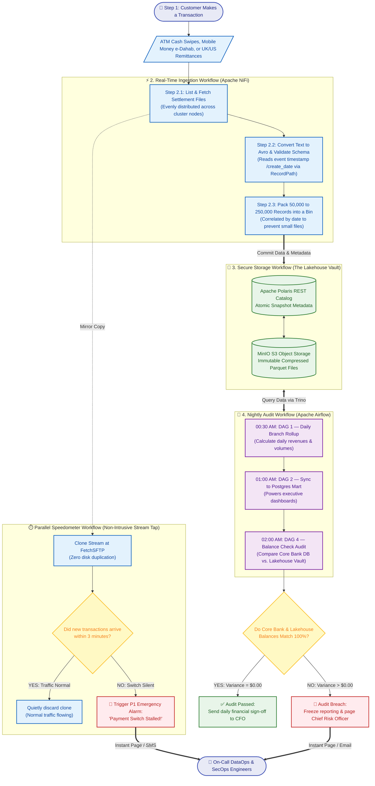
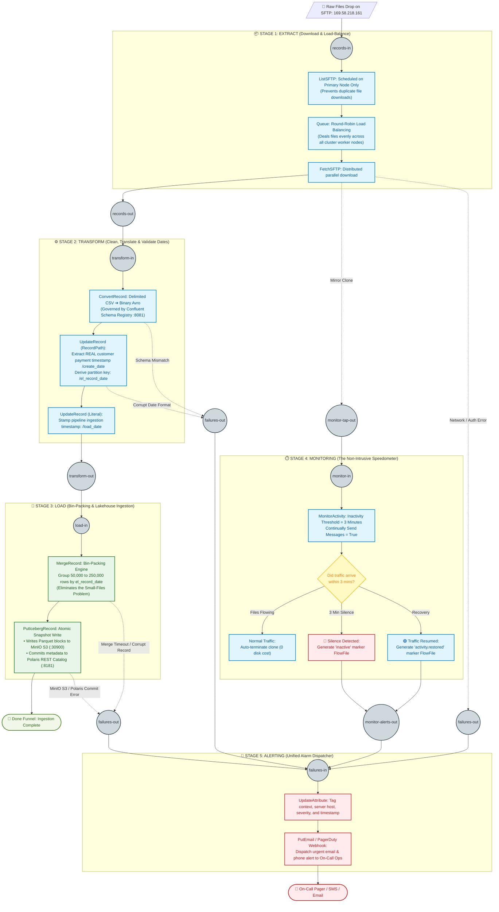
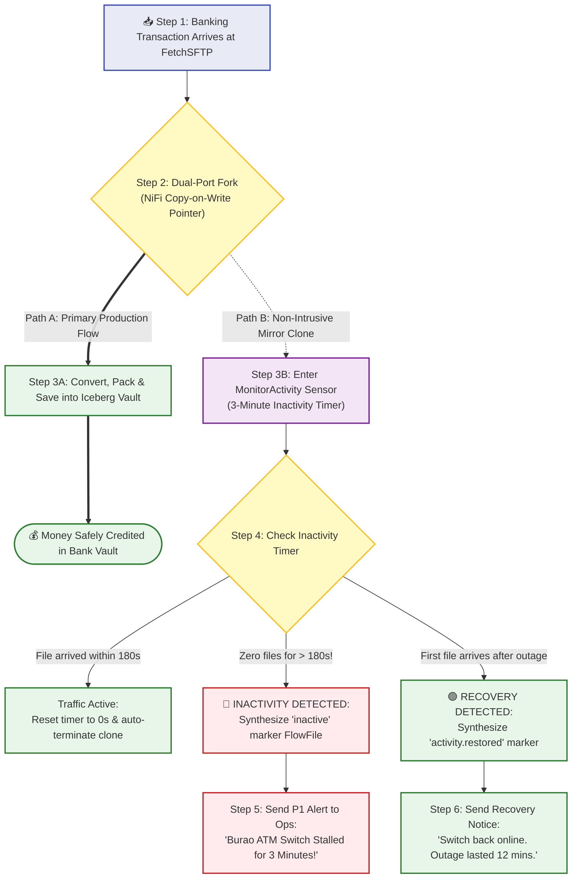
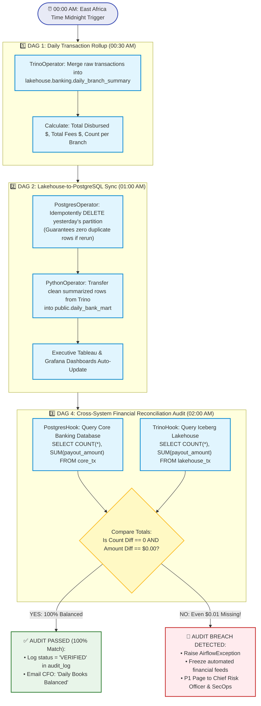
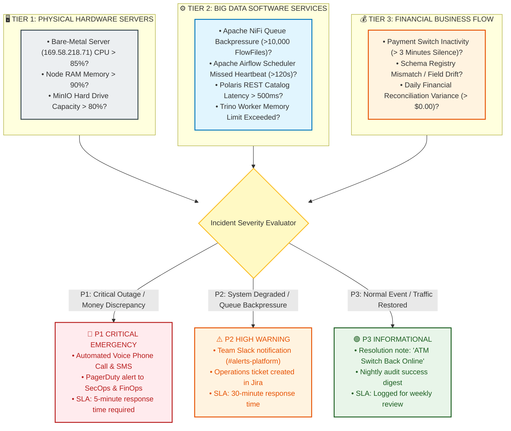
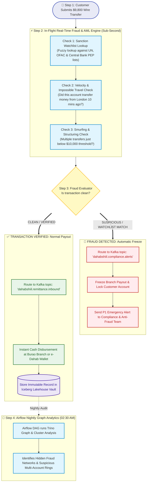
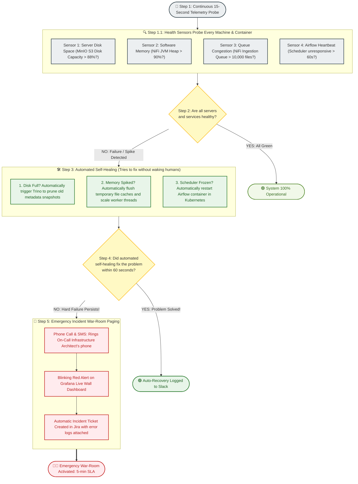

# 🏦 The Bank Data Platform & Automated Watchdog: Visual Workflow Guide
### Complete Step-by-Step Mermaid Workflows for the Banking Pipeline, Airflow Orchestration & 24/7 Monitoring
*(Designed for anyone to understand—explained with clean visual workflows and plain English!)*

---

## 🗺️ Master Workflow 1: End-to-End Banking Data Lifecycle

This is the primary workflow diagram showing the complete journey of a financial transaction: from the moment a customer touches an ATM, through real-time streaming, lakehouse storage, nightly audit, and emergency alerting.

> ### 🗣️ What to Say When Showing Master Workflow 1:
> *"This workflow shows the entire lifecycle of bank data:  
> 1. A customer swipes their card or sends money on the top left.  
> 2. The transaction flows into our NiFi ingestion workflow, which checks dates and packs records into large, efficient bins.  
> 3. Records are committed to our Iceberg Lakehouse vault.  
> 4. In parallel, our stream-tap sensor watches traffic like a speedometer—if transactions stop for 3 minutes, it alerts the on-call team.  
> 5. At night, Apache Airflow wakes up to audit yesterday's totals. If a single cent does not match the core banking ledger, it immediately halts reporting and pages leadership."*

---

## 🧩 Lab 4 Workflow 2: The 5-Stage Modular NiFi Pipeline

In **Lab 4**, we split our pipeline into **5 isolated stages (Process Groups)** that communicate **only through Input and Output Ports**. This prevents one broken processor from crashing the entire bank.

> ### 🗣️ What to Say When Showing Lab 4 Workflow 2:
> *"Notice the modularity:  
> - **Stage 1 (Extract)**: `ListSFTP` runs on the Primary Node only to prevent duplicate downloads, and deals work out via Round-Robin balancing.  
> - **Stage 2 (Transform)**: Converts raw text to Avro and uses **RecordPath** to read the customer's actual transaction time (`/create_date`) rather than file arrival time.  
> - **Stage 3 (Load)**: Bins 50k to 250k transactions together before writing to Iceberg and MinIO S3, solving the Small-Files Problem.  
> - **Stage 4 (Monitoring)**: Taps a mirror copy to check if the ATM switch stalls for > 3 minutes.  
> - **Stage 5 (Alerting)**: Catches any failure across all stages and pages the engineer."*

---

## ⏱️ Workflow 3: The Stream Tap & Inactivity Detection Engine

This workflow explains how our **Stream Tap** detects a dead payment switch without slowing down or risking real customer payments.

> ### 🗣️ What to Say When Showing Workflow 3:
> *"Why is this design brilliant?  
> Look at the fork at Step 2: Path A is the real bank money, heading straight into storage. Path B is a zero-cost mirror copy that feeds our 3-minute timer.  
> Because the sensor is on a separate branch, it can NEVER block or delay customer payments. If files are flowing, it quietly drops the clone. But if 3 minutes pass with zero files, it synthesizes an emergency alert and pages on-call staff!"*

---

## 🌙 Workflow 4: Apache Airflow's Nightly Audit & Reconciliation

This workflow details what happens every night between **00:00 and 02:30 AM**, when Apache Airflow acts as the automated bank auditor.

> ### 🗣️ What to Say When Showing Workflow 4:
> *"Here is how Airflow enforces financial integrity:  
> - At **00:30 AM**, DAG 1 calculates yesterday's total branch disbursements and fee revenues.  
> - At **01:00 AM**, DAG 2 pushes these clean numbers into PostgreSQL for executive dashboards using an idempotent delete-then-insert pattern.  
> - At **02:00 AM**, DAG 4 runs our **Cross-System Audit**: it fetches the official bank vault balance from Core Banking PostgreSQL and compares it against our Iceberg Lakehouse.  
> - If they match 100%, it logs a clean audit and emails the CFO. If even 1 penny is off, it halts the system and pages leadership!"*

---

## 🛡️ Workflow 5: The 3-Tier Bank Watchdog & Escalation Matrix

This workflow details how the platform monitors physical servers, big-data software daemons, and banking transaction flows around the clock.

> ### 🗣️ What to Say When Showing Workflow 5:
> *"Our Bank Watchdog monitors three distinct layers:  
> 1. **Hardware**: Are any servers overheating or running out of disk space?  
> 2. **Software**: Are NiFi, Airflow, and the database processing without thread lock?  
> 3. **The Business**: Is money flowing properly?  
> Any issue is immediately routed by severity: P1 incidents trigger an automated phone call to on-call engineers, P2 warnings alert our Slack channel, and P3 notices confirm when the system has successfully recovered."*

---

---

## 🕵️ Workflow 6: Real-World Example 1 — Real-Time Bank Fraud & AML Detection System

In a major bank like **Dahabshiil Bank**, thousands of international remittances and mobile money transfers arrive every minute. If stolen credit cards, money laundering, or sanctioned individuals move money through the bank, **the bank can face millions in regulatory fines or lose its banking license**.

> ### 🗣️ What to Say When Showing Workflow 6 (Fraud Detection):
> *"Here is how our real-time fraud system works:  
> 1. When a \$9,800 transfer arrives from London, it goes through 3 instant checks in less than a second: a sanctions watchlist check (UN/OFAC), an impossible travel check (could the sender be in two cities at once?), and a structuring check (trying to stay below \$10,000).  
> 2. If it fails ANY check, the money is instantly frozen BEFORE it can be paid out at the branch, and our compliance officer gets an immediate alert.  
> 3. If clean, the family receives their money immediately, and the transaction is permanently stored in our Iceberg vault.  
> 4. Finally, every night at 2:30 AM, Apache Airflow analyzes 90 days of transaction graphs to uncover hidden money-laundering rings!"*

---

## 🖥️ Workflow 7: Real-World Example 2 — 24/7 Server & Service Sentinel (Self-Healing & Alerting)

Computer hardware and data services can run out of memory, fill up disks, or freeze. In a bank, **downtime costs thousands of dollars per minute**. Here is how our automated Server Sentinel detects problems, heals itself, and alerts engineers.

> ### 🗣️ What to Say When Showing Workflow 7 (Server Sentinel):
> *"Here is how our platform stays online 24 hours a day without crashes:  
> 1. Every 15 seconds, our Sentinel probes hardware disks, computer memory, queue depths, and software heartbeats.  
> 2. If a server starts running out of disk or memory, the system doesn't immediately wake up engineers at 3 AM. It first runs **Automated Self-Healing**: it clears old temporary files, compacts storage, or reboots the frozen container.  
> 3. If self-healing resolves the issue, it logs a quiet green note to Slack.  
> 4. But if the problem persists for more than 60 seconds, it sounds the alarms: an automated voice call wakes up the lead engineer, an incident ticket is generated with exact error logs, and the emergency team resolves it before customers ever experience an outage!"*

---

## 🎤 The 60-Second Presentation Cheat Sheet

When someone asks you to explain the architecture during an interview, meeting, or demo, follow this simple 5-step script:

| Step | What to Point at: | Exactly What to Say: |
| :--- | :--- | :--- |
| **1. The Problem** | Master Workflow 1 (Sources) | *"We process millions of dollars daily from ATMs, mobile phones, and remittances across Dahabshiil Bank. If an ATM goes offline or a transaction is dropped, the bank loses money."* |
| **2. The Ingestion Engine** | Lab 4 Workflow 2 (5 Rooms) | *"In Lab 4, we built an Apache NiFi pipeline split into 5 isolated rooms. It cleans the text, dates transactions by when the customer paid rather than file arrival, and packs 100,000 records together into our Iceberg Lakehouse vault."* |
| **3. Stream Tap & Inactivity** | Workflow 3 (Stream Tap) | *"We tap a mirror copy of the stream into a 3-minute silence detector. If a payment switch dies, it fires a P1 alarm instantly without ever touching or risking real customer payments."* |
| **4. Real-Time Fraud & AML** | Workflow 6 (Fraud System) | *"Every payment undergoes sub-second AML and impossible-travel screening. If flagged, payouts are frozen before cash leaves the branch, and Airflow runs deep graph scans nightly."* |
| **5. Self-Healing Server Sentinel** | Workflow 7 (Server Sentinel) | *"Every 15 seconds, our Sentinel checks server disks and RAM. It self-heals by pruning old snapshots, and calls engineers by phone if a hard failure persists."* |
| **6. Airflow Nightly Audit** | Workflow 4 (Airflow) | *"Every night at 2:00 AM, Apache Airflow compares the Core Banking database against the Lakehouse vault. If there is even a single penny missing, it halts reporting and pages the Chief Risk Officer."* |

---

*Authored for Telesom & Dahabshiil Group — Big Data Platform Engineering.*  
*Visual Workflow Master Guide — Lab 4 Modular Pipeline, Apache Airflow & 24/7 Bank Watch.*

